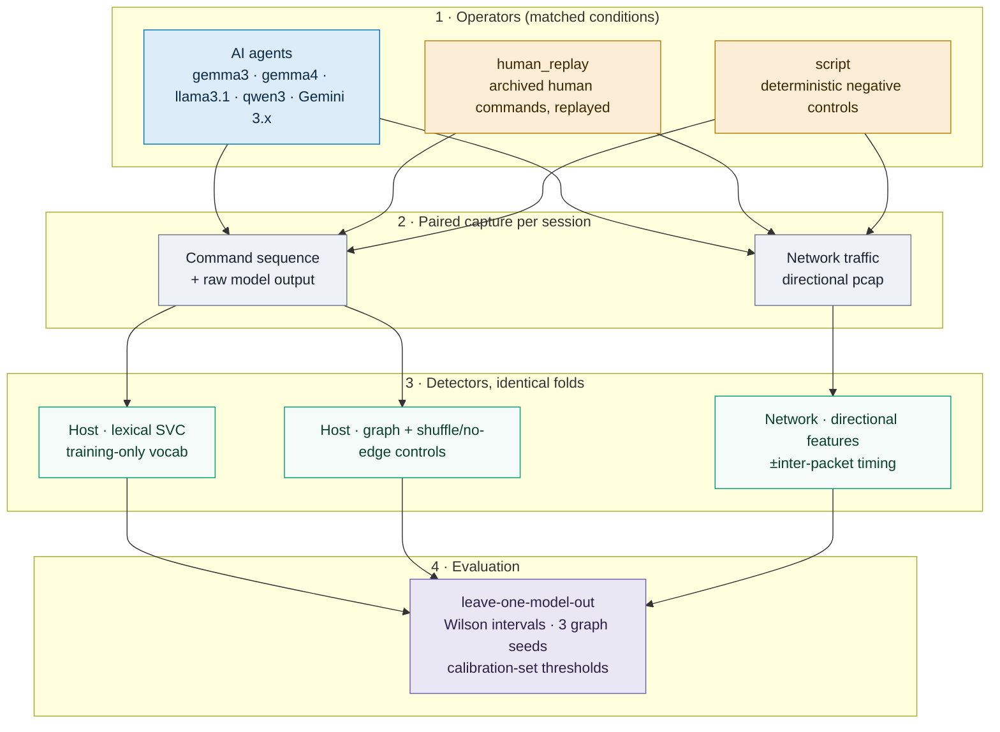

<h1 align="center">AI-Attack IDS</h1>
<p align="center"><b>Can a detector tell whether the operator behind a shell session is an AI agent — from behavior alone?</b></p>

<p align="center">
  <a href="#-english"></a>
  <a href="#-türkçe"></a>
</p>

<p align="center">
  
  
  
  
</p>

> **A research pilot.** It measures whether an intrusion detector can identify an AI operator
> behind a shell session, from the command sequence and the network traffic, under matched
> conditions. Method: **[experiments/PROTOCOL.md](experiments/PROTOCOL.md)** ·
> required live-human follow-up: **[experiments/HUMAN_STUDY.md](experiments/HUMAN_STUDY.md)**.
> The full technical report is **[REPORT.md](REPORT.md)** (bilingual).

---

<details open id="-english">
<summary><h2>🇬🇧 English</h2></summary>

### The question

> *"Can we build an IDS that tells whether an incoming attack is driven by an AI agent rather than a human or a script, no matter which model is behind it?"*

This is not model attribution — we are not asking *which* LLM this is, only whether the operator behind the session is a language model at all. We answer it by fingerprinting behavior over the command sequence and the network traffic, and test whether that fingerprint holds for models the detector has never seen.

### How it is measured

Every session is captured two ways at once — the command sequence and a directional pcap — for three operator classes: AI agents, `human_replay` (archived human commands replayed by a program), and deterministic `script` controls. The evaluation contract (`scripts/eval_common.py`) is deliberately conservative:

- **The model's own commands are scored.** The harness does not inject flags into agent commands; where a logged command carries executor-added flags (337 of 3,215 malicious/evasion commands), the model's own text from `raw_command` is used instead, so the detector sees agent behavior, not harness formatting.
- **Directional network features.** Ports/IPs/SYNs come from outbound traffic only; the received-RST fraction from inbound only; SSH transport direction from the first TCP SYN's endpoints.
- **Training-only preprocessing.** The common vocabulary, TF-IDF and scalers are fit on training data only, after a 20-command cap, with network commands removed. Empty or unparseable sessions are kept, not dropped.
- **Honest uncertainty.** Session recall/FPR carry Wilson intervals; the graph model runs on three seeds (17/42/73) reported as a min–max range, not a confidence interval; false-positive thresholds are chosen only on a held-out calibration set.
- **Held-out everything that matters.** Leave-one-model-out for the AI side; disjoint human recording groups for train / calibration / test; script controls never enter training.

### Host layer: does the command signature generalize to unseen models?

Each AI model is held out of training entirely and then tested against held-out human groups (first-20-command cap, training-only shared vocabulary, network commands removed). The graph range is min–max over three seeds, not a confidence interval.

| held-out model | AI n | SVC recall | SVC 95% Wilson | SVC FPR | graph recall (seeds) | ensemble (seeds) |
|---|---:|---:|---|---:|---|---|
| gemini-3.1-pro | 14 | 0.857 | 0.601–0.960 | 0.050 | 0.571–0.786 | 0.857 |
| gemini-3.5-flash | 49 | 0.939 | 0.835–0.979 | 0.050 | 0.959 | 0.959 |
| gemma3 | 24 | 0.708 | 0.508–0.851 | 0.025 | 0.583–0.625 | 0.792–0.833 |
| gemma4 | 23 | 0.783 | 0.581–0.903 | 0.025 | 0.565–0.696 | 0.783–0.826 |
| llama3.1 | 23 | 0.913 | 0.732–0.976 | 0.025 | 0.783–0.870 | 0.957–1.000 |
| qwen3 | 8 | 1.000 | 0.676–1.000 | 0.050 | 0.875–1.000 | 1.000 |

A held-out model is recognized well above chance — lexical SVC recall **0.71–1.00** at 2.5–5% human false-positive rate — which is a real signal. But the Wilson intervals are wide on this sample, and the two Gemini models come from one provider, so they are not two independent frontier families.

### Does the transition graph add signal? No clear evidence

Averaged over the model folds (equal weight per fold):

| method | mean recall | mean human FPR |
|---|---:|---:|
| lexical SVC | **0.867** | 0.037 |
| category-frequency logistic | 0.801 | 0.079 |
| graph (topology, seed 42) | 0.758 | 0.071 |
| graph with **shuffled** command order | 0.799 | 0.104 |
| graph with **edges removed** | 0.785 | 0.067 |
| OR-ensemble (SVC ∪ graph) | 0.913 | 0.087 |

Shuffling the command order or deleting the edges barely changes the graph model, and the lexical SVC alone beats it — so a high ensemble number does **not** demonstrate that transition *topology* carries the signal. The lexical SVC is the primary detector; the graph is an inconclusive control.

### The state-verification tendency

LLM agents re-query their context (`pwd`, `whoami`, `id`, `uname`, `hostname`) far more than the human recordings do — 503 state-check commands across the malicious/evasion set. This is a genuine behavioral difference, but the recon prompts also instruct a `pwd` fallback, so it is not a prompt-free, intrinsic property. It is also load-bearing for the detector: a `no_state` ablation (removing those five tokens from the vocabulary) drops SVC recall markedly (gemma3 0.71→0.50, qwen 1.00→0.13). A prompt-free, live-human replication is required to settle whether the tendency is intrinsic.

### Adaptive evasion

Under a white-box prompt that tells the agent to suppress the reflex (`evade_recon` / `evade_exploit`), the state-check share collapses, and the lexical detector's response is model-dependent (`evasion:gemma4` recall 1.00, `evasion:llama` 0.67, `evasion:gemma3` 0.75). Retraining on evasive traffic recovers some models and not others. This is an arms-race signal on a small sample — and suppressing all useful reconnaissance must not count as successful evasion.

### Network layer

- **On the legacy captures** (14 pcaps, 8 AI / 6 replay, Random Forest, out-of-session split), directional features reach macro F1 **0.714** (a preprocessing comparison; these captures excluded port-22 traffic, so it is not an unseen-model test).
- **On the paired lab** (48 sessions, identical host/network/combined folds), network features — especially with inter-packet **timing** — separate AI from replay strongly (combined F1 up to 1.00; host alone ≈ 0.60–0.82). But this runs on a **loopback** lab with no realistic latency or loss, the negatives are replay rather than live humans, and the agent's constrained port budget differs from the replay's task. Timing carries most of the separation, and four unseen scripts are frequently mis-flagged.
- **HASSH** (SSH client fingerprint) identifies a *programmatic client* — paramiko vs OpenSSH — which also covers Ansible/CI, rather than agency itself.

### Task coverage — some agents barely act

Coverage = the share of expected open services that returned a SYN+ACK during the session. It does not prove comprehension or exploitation, but it separates real reconnaissance from agents that stall:

| operator | sessions | mean open-service coverage | commands run | timeouts |
|---|---:|---:|---:|---:|
| gemma3:4b | 8 | 0.411 | 48 | 15 |
| gemma4:latest | 8 | 1.000 | 43 | 0 |
| llama3.1:8b | 8 | 1.000 | 37 | 3 |
| **qwen3:4b** | 8 | **0.000** | **0** | 0 |
| human_replay | 12 | 0.892 | 72 | 4 |
| script | 4 | 0.240 | 18 | 0 |

`qwen3:4b` emits no usable commands, so any "detection" of it is detection of an empty session.

### Intent axis (malicious vs benign)

Across the command corpora, leave-one-group-out macro F1 is **0.896**; within the AI side only, leave-one-model-out is **0.785**. This is **descriptive corpus classification, not independent evidence of malice**: the corpora differ in source and era, and the labels come from the assigned task, not from proven harm. A live, matched-task benign/malicious human study is required before any intent claim.

### Honest limitations

- **The human class is replay, not live participation.** Every human negative is a program replaying archived commands. The study is not complete until live participants choose commands from the same task instructions and outputs ([HUMAN_STUDY.md](experiments/HUMAN_STUDY.md)).
- **The sample is a pilot.** 48 paired sessions ({ai: 32, replay: 12, script: 4}, 8 zero-traffic AI kept, 2 collector errors excluded); the command/network sets are similarly small. Wilson intervals do not model session dependence or training variance.
- **No validated low FPR.** Thresholds are picked on 80 calibration humans; with 40 test humans the FPR resolution is 2.5%. A 1% population false-positive rate is not demonstrated — with zero observed false positives, the one-sided 95% bound clears 1% only near ~299 independent negatives.
- **The graph's contribution is unproven** (shuffle / no-edge controls ≈ the real graph).
- **The two frontier models are one provider.** Gemini-3.1-pro / 3.5-flash are not independent families; the pro model was heavily API-rate-limited (small n).
- **The network result is loopback and confounded.** No realistic jitter/loss; replay ≠ human; scan-budget mismatch; timing dominates the separation.
- **The environment/context variants are one driver** — two service profiles and two context policies of the same collector, not independent agent frameworks.
- **Open work:** live matched-task humans, independently-implemented agents, broader tasks/environments, adaptive evasion that preserves reconnaissance success, a real network-impairment experiment, and independent field testing.

### Architecture



### Reproduce

Python 3.11. Raw sessions and pcaps stay in git-ignored directories; result JSONs under `experiments/` preserve per-fold predictions, IDs and parameters. The exact command sequence, image digests and dependency lock are in **[experiments/PROTOCOL.md](experiments/PROTOCOL.md)**. Collection needs the Docker lab images (`lab-attacker`, `lab-target`), the four local Ollama models, and the lab subnet free.

### Repository layout

```
harness/       session drivers and the paired host+pcap lab collector
scripts/       host, network and intent evaluators; shared eval contract; loaders
experiments/   results, protocol, live-human follow-up plan, per-fold prediction JSON,
               runtime/model manifest and dependency lock
tests/         protocol invariants
report.html    bilingual HTML report
```

### Data sources

| dataset | role | link |
|---|---|---|
| **MUNI shell commands** | real human commands (replayed as negatives) | [Zenodo 8136017](https://zenodo.org/records/8136017) (CC-BY-4.0) |
| **DTU "Honey for the Agent"** | malicious+AI reference, deception design | [Zenodo 20818246](https://zenodo.org/records/20818246) (CC-BY-4.0) |
| **Schonlau SEA** | real benign human command streams (intent corpus) | [schonlau.net](https://www.schonlau.net/intrusion.html) |
| **Gemini 3.x API** | frontier AI host sessions (gemini-3.1-pro, gemini-3.5-flash) | [ai.google.dev](https://ai.google.dev) |
| **TRACE** | fingerprinting-pipeline reference | [arXiv 2605.01186](https://arxiv.org/abs/2605.01186) |

</details>

---

<details id="-türkçe">
<summary><h2>🇹🇷 Türkçe</h2></summary>

### Soru

> *"Sisteme gelen bir saldırının, arkasındaki model ne olursa olsun, bir insan ya da script yerine bir AI ajanı tarafından sürüldüğünü ayırt eden bir IDS kurabilir miyiz?"*

Bu, model atıfı değil — *hangi* LLM olduğunu değil, operatörün bir dil modeli olup olmadığını soruyoruz. Yanıtı komut dizisi ve ağ trafiği üzerinden davranışı parmak izleyerek veriyoruz ve imzanın hiç görülmemiş modellere genelleşip genelleşmediğini test ediyoruz.

### Nasıl ölçülüyor

Her oturum aynı anda iki biçimde yakalanır — komut dizisi ve yönlü bir pcap — üç operatör sınıfı için: AI ajanları, `human_replay` (arşivlenmiş insan komutlarının bir programca oynatılması) ve deterministik `script` kontrolleri. Değerlendirme sözleşmesi (`scripts/eval_common.py`) bilinçli olarak temkinlidir:

- **Modelin kendi komutu skorlanır.** Harness ajan komutlarına bayrak enjekte etmez; bir kayıtlı komut executor-eklentili bayrak taşıyorsa (3.215 malicious/evasion komutunun 337'si) yerine modelin `raw_command`'daki kendi metni kullanılır; böylece dedektör harness biçimlemesini değil ajan davranışını görür.
- **Yönlü ağ özellikleri.** Portlar/IP'ler/SYN'ler yalnız giden trafikten; alınan-RST oranı yalnız gelen trafikten; SSH taşıma yönü ilk TCP SYN'e göre.
- **Yalnız-eğitimde ön işleme.** Ortak sözlük, TF-IDF ve ölçekleyiciler yalnız eğitim verisinde, 20-komut sınırından sonra, ağ komutları çıkarılarak fit edilir. Boş veya çözümlenemeyen oturumlar atılmaz, tutulur.
- **Dürüst belirsizlik.** Oturum recall/FPR Wilson aralıkları taşır; grafik model üç tohumla (17/42/73) çalışır ve güven aralığı değil min–max aralığı olarak verilir; yanlış-pozitif eşikleri yalnız ayrık bir calibration setinde seçilir.
- **Önemli her şey dışarıda tutulur.** AI tarafı için leave-one-model-out; ayrık insan kayıt grupları train / calibration / test için; script kontrolleri eğitime asla girmez.

### Host katmanı: komut imzası görülmemiş modellere genelleşiyor mu?

Her AI modeli eğitimden tamamen çıkarılır ve dışarıda tutulan insan gruplarına karşı test edilir (ilk-20-komut sınırı, yalnız-eğitimden ortak sözlük, ağ komutları çıkarılmış). Grafik aralığı üç tohum üzerinde min–max'tır, güven aralığı değildir.

| dışarıda tutulan model | AI n | SVC recall | SVC %95 Wilson | SVC FPR | grafik recall (tohum) | ensemble (tohum) |
|---|---:|---:|---|---:|---|---|
| gemini-3.1-pro | 14 | 0.857 | 0.601–0.960 | 0.050 | 0.571–0.786 | 0.857 |
| gemini-3.5-flash | 49 | 0.939 | 0.835–0.979 | 0.050 | 0.959 | 0.959 |
| gemma3 | 24 | 0.708 | 0.508–0.851 | 0.025 | 0.583–0.625 | 0.792–0.833 |
| gemma4 | 23 | 0.783 | 0.581–0.903 | 0.025 | 0.565–0.696 | 0.783–0.826 |
| llama3.1 | 23 | 0.913 | 0.732–0.976 | 0.025 | 0.783–0.870 | 0.957–1.000 |
| qwen3 | 8 | 1.000 | 0.676–1.000 | 0.050 | 0.875–1.000 | 1.000 |

Dışarıda tutulan model şanstan belirgin yüksek tanınıyor — sözcüksel SVC recall **0.71–1.00**, %2.5–5 insan yanlış-pozitif oranıyla — bu gerçek bir sinyal. Ama bu örneklemde Wilson aralıkları geniş ve iki Gemini modeli tek sağlayıcıdan geliyor, yani bağımsız iki frontier aile değiller.

### Geçiş grafiği sinyal ekliyor mu? Net kanıt yok

Model foldları üzerinde ortalama (fold başına eşit ağırlık):

| yöntem | ortalama recall | ortalama insan FPR |
|---|---:|---:|
| sözcüksel SVC | **0.867** | 0.037 |
| kategori-frekansı lojistik | 0.801 | 0.079 |
| grafik (topoloji, tohum 42) | 0.758 | 0.071 |
| grafik, **sırası karıştırılmış** | 0.799 | 0.104 |
| grafik, **kenarları çıkarılmış** | 0.785 | 0.067 |
| OR-topluluğu (SVC ∪ grafik) | 0.913 | 0.087 |

Komut sırasını karıştırmak veya kenarları silmek grafik modeli neredeyse değiştirmiyor ve sözcüksel SVC tek başına onu geçiyor — yani yüksek topluluk sayısı, sinyali *topolojinin* taşıdığını **kanıtlamıyor**. Birincil dedektör sözcüksel SVC; grafik sonuçsuz bir kontrol.

### Durum-yoklama eğilimi

LLM ajanları bağlamı (`pwd`, `whoami`, `id`, `uname`, `hostname`) insan kayıtlarından çok daha fazla sorguluyor — malicious/evasion setinde 503 durum-kontrol komutu. Bu gerçek bir davranış farkı, ama keşif promptları da bir `pwd` fallback'i söylüyor, dolayısıyla promptsuz, içsel bir özellik değil. Dedektör için de belirleyici: bir `no_state` ablation'ı (bu beş token'ı sözlükten çıkarmak) SVC recall'ını belirgin düşürüyor (gemma3 0.71→0.50, qwen 1.00→0.13). Eğilimin içsel olup olmadığını çözmek için promptsuz, canlı-insan replikasyonu gerekir.

### Adaptif kaçınma

Ajana refleksi bastırmasını söyleyen beyaz-kutu prompt altında (`evade_recon` / `evade_exploit`), durum-kontrol payı çöküyor ve sözcüksel dedektörün tepkisi modele bağlı (`evasion:gemma4` recall 1.00, `evasion:llama` 0.67, `evasion:gemma3` 0.75). Kaçınma trafiğiyle yeniden eğitim bazı modelleri kurtarıyor, bazılarını değil. Bu, küçük örneklemde bir silahlanma-yarışı sinyali — ve tüm yararlı keşfi bastırmak "başarılı kaçınma" sayılmamalı.

### Ağ katmanı

- **Eski yakalamalarda** (14 pcap, 8 AI / 6 replay, Random Forest, oturum-dışı split), yönlü özellikler macro F1 **0.714**'e ulaşıyor (bir ön-işleme karşılaştırması; bu yakalamalar port-22'yi dışladı, dolayısıyla görülmemiş-model testi değil).
- **Eşlenmiş labda** (48 oturum, aynı host/ağ/birleşik foldlar), ağ özellikleri — özellikle paketler-arası **zamanlama** ile — AI'yı replay'den güçlü ayırıyor (birleşik F1 1.00'a kadar; yalnız host ≈ 0.60–0.82). Ama bu, gerçekçi gecikme/kayıp olmayan bir **loopback** labda; negatifler canlı insan değil replay; ajanın dar port bütçesi replay'in görevinden farklı. Ayrımı çoğunlukla zamanlama taşıyor ve dört görülmemiş script sıkça yanlış işaretleniyor.
- **HASSH** (SSH istemci parmak izi) bir *programatik istemci* — paramiko vs OpenSSH — tanımlıyor, ki Ansible/CI de buna dahil; ajansın kendisini değil.

### Görev kapsamı — bazı ajanlar neredeyse hiç iş yapmıyor

Kapsam = oturum boyunca SYN+ACK dönen beklenen açık servislerin oranı. Anlama veya exploit'i kanıtlamaz, ama gerçek keşfi tıkanan ajanlardan ayırır:

| operatör | oturum | ortalama açık-servis kapsamı | çalıştırılan komut | timeout |
|---|---:|---:|---:|---:|
| gemma3:4b | 8 | 0.411 | 48 | 15 |
| gemma4:latest | 8 | 1.000 | 43 | 0 |
| llama3.1:8b | 8 | 1.000 | 37 | 3 |
| **qwen3:4b** | 8 | **0.000** | **0** | 0 |
| human_replay | 12 | 0.892 | 72 | 4 |
| script | 4 | 0.240 | 18 | 0 |

`qwen3:4b` kullanılabilir komut üretmiyor; onun "tespiti" boş bir oturumun tespitidir.

### Niyet ekseni (zararlı vs zararsız)

Komut korpuslarında leave-one-group-out macro F1 **0.896**; yalnız AI tarafında leave-one-model-out **0.785**. Bu **betimsel korpus sınıflandırması, bağımsız kötü-niyet kanıtı değildir**: korpuslar kaynak ve dönem olarak farklı ve etiketler verilen görevden gelir, kanıtlı zarardan değil. Herhangi bir niyet iddiasından önce canlı, eş görevli insan çalışması gerekir.

### Dürüst sınırlamalar

- **İnsan sınıfı replay'dir, canlı katılım değil.** Her insan negatifi, arşivlenmiş komutları oynatan bir programdır. Canlı katılımcılar aynı görev talimatı ve çıktılardan komut seçene dek çalışma tamamlanmış sayılmaz ([HUMAN_STUDY.md](experiments/HUMAN_STUDY.md)).
- **Örneklem bir pilot.** 48 eşlenmiş oturum ({ai: 32, replay: 12, script: 4}, 8 sıfır-trafik AI tutuldu, 2 collector hatası dışlandı); komut/ağ setleri de küçük. Wilson aralıkları oturum bağımlılığını ve eğitim varyansını modellemez.
- **Doğrulanmış düşük FPR yok.** Eşikler 80 calibration insanında seçilir; 40 test insanıyla FPR çözünürlüğü %2.5. %1 popülasyon yanlış-pozitif oranı gösterilmedi — sıfır yanlış-pozitifle tek-taraflı %95 sınır %1'in altına ancak ~299 bağımsız negatifte iner.
- **Grafiğin katkısı kanıtlanmadı** (karıştırma / kenarsız kontroller ≈ gerçek grafik).
- **İki frontier model tek sağlayıcı.** Gemini-3.1-pro / 3.5-flash bağımsız aileler değil; pro model ağır API rate-limit yedi (küçük n).
- **Ağ sonucu loopback ve confound'lu.** Gerçekçi jitter/kayıp yok; replay ≠ insan; tarama-bütçesi uyumsuz; ayrımı zamanlama baskılıyor.
- **Ortam/bağlam varyantları tek sürücü** — aynı toplayıcının iki servis profili ve iki bağlam politikası, bağımsız ajan frameworkleri değil.
- **Açık işler:** canlı eş-görevli insanlar, bağımsız uygulanmış ajanlar, daha geniş görev/ortamlar, keşif başarısını koruyan adaptif kaçınma, gerçek ağ-bozunumu deneyi, bağımsız saha testi.

### Mimari, tekrar üretim, depo yapısı, veri kaynakları

Mimari diyagramı, çalıştırma yönergesi, dosya düzeni ve veri kaynakları için yukarıdaki İngilizce bölüme bakın; yöntem ve komutlar **[experiments/PROTOCOL.md](experiments/PROTOCOL.md)** içindedir.

</details>

---

<p align="center"><sub>Local open-weight models (Ollama) + Docker · isolated lab · research and defensive use only</sub></p>
