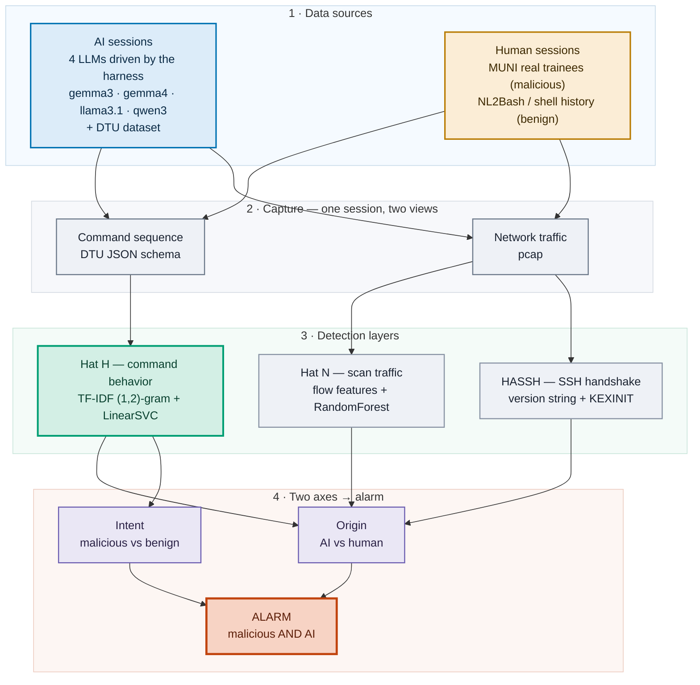
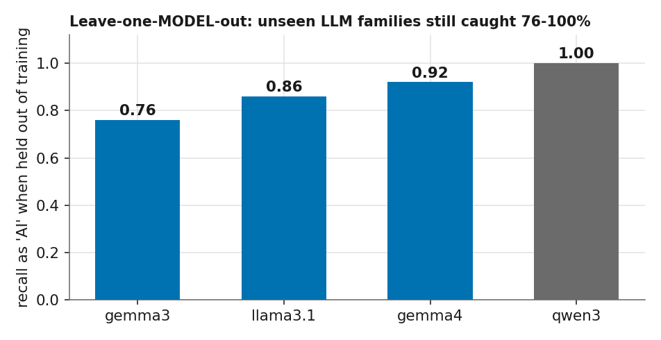
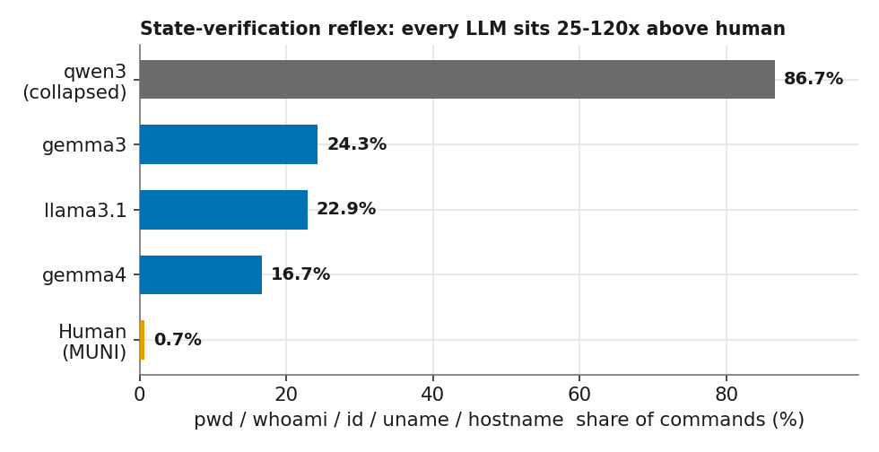
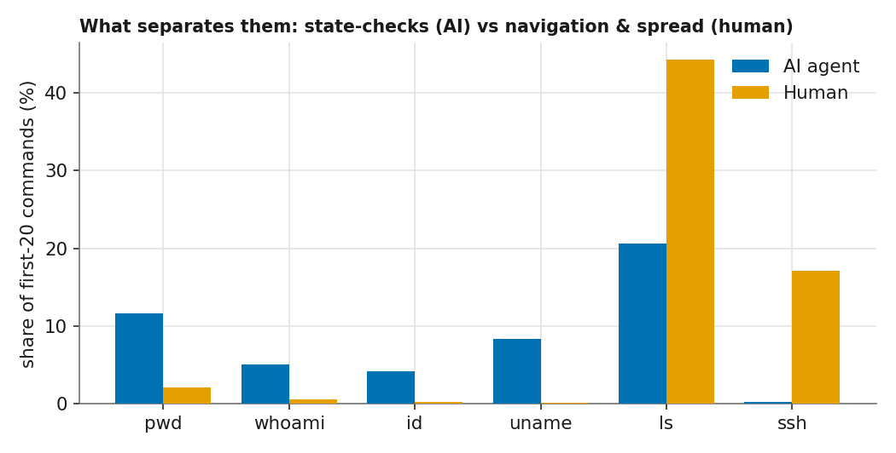
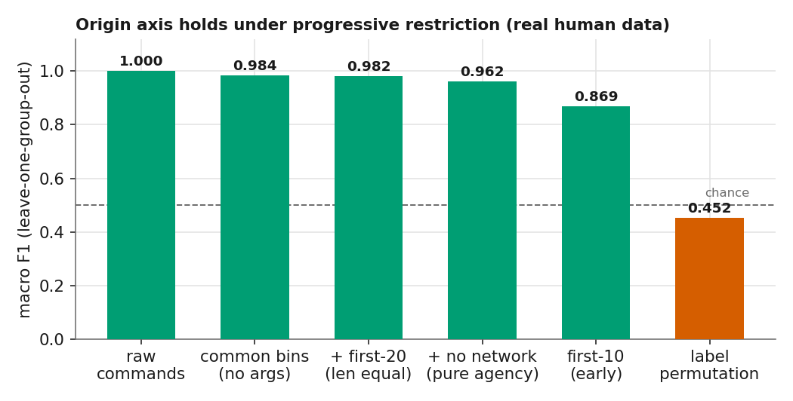
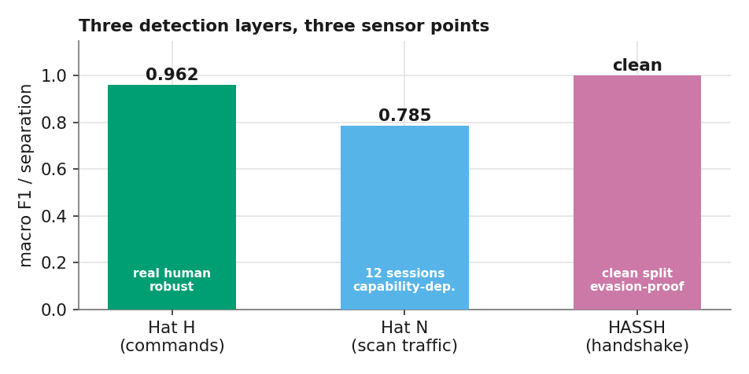
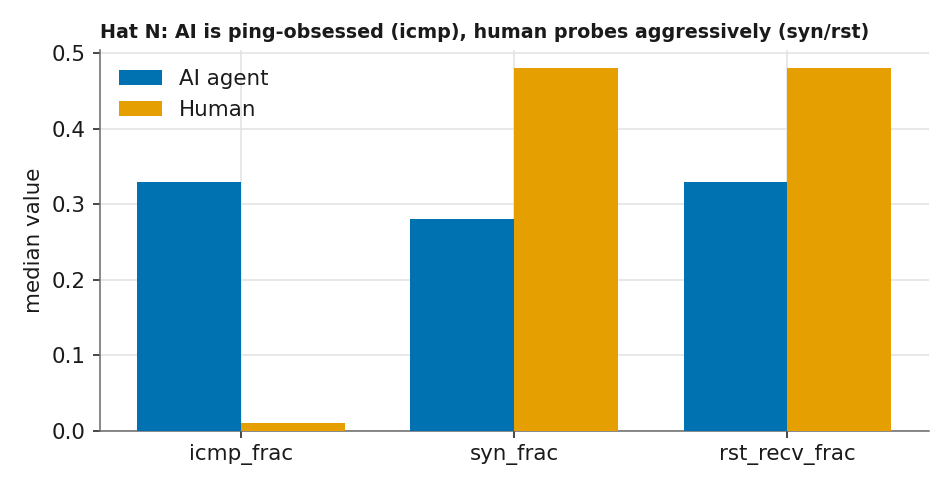
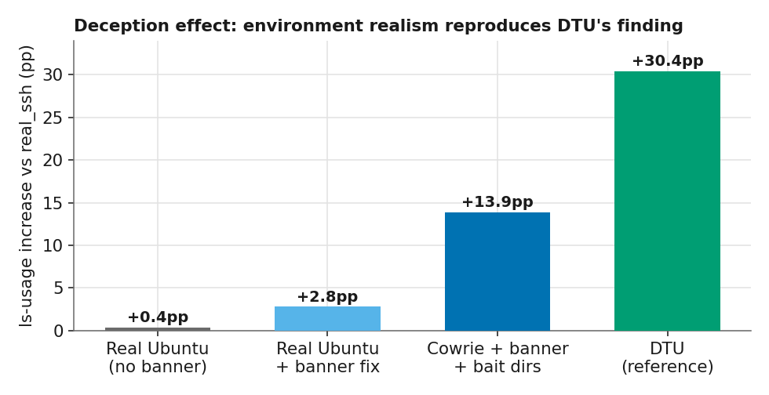
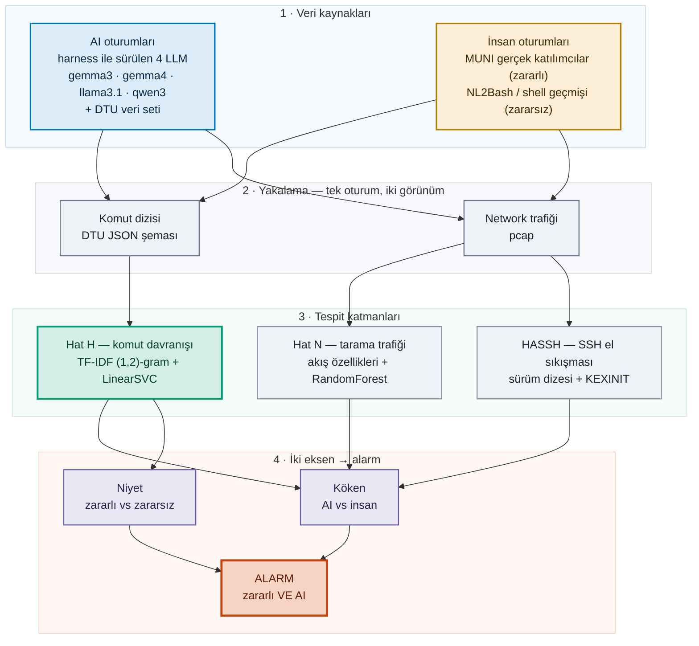

<h1 align="center">AI-Attack IDS</h1>
<p align="center"><b>Detecting LLM-driven attacks by behavioral fingerprinting.</b></p>

<p align="center">
  <a href="#-english"></a>
  <a href="#-türkçe"></a>
</p>

<p align="center">
  
  
  
  
</p>

<p align="center">
  <a href="REPORT.md"></a>
  &nbsp;
  <a href="https://claude.ai/code/artifact/e98339a3-aef4-451d-af14-a5e492c5dea3"></a>
</p>

> **Language / Dil** — English opens by default. Click **🇹🇷 Türkçe** below to expand the Turkish version.
>
> **This README** gives the overview, architecture and findings. For the standalone write-up, see **[REPORT.md](REPORT.md)** (bilingual) or the **[interactive HTML report](https://claude.ai/code/artifact/e98339a3-aef4-451d-af14-a5e492c5dea3)** with a live language toggle. &nbsp;·&nbsp; Bu README genel bakış, mimari ve bulguları veriyor; müstakil rapor için **[REPORT.md](REPORT.md)** (iki dilli) ya da canlı dil değiştirmeli **[interaktif HTML rapor](https://claude.ai/code/artifact/e98339a3-aef4-451d-af14-a5e492c5dea3)**.

---

<details open id="-english">
<summary><h2>🇬🇧 English</h2></summary>

### The question

> *"Can we build an IDS that tells whether an incoming attack is driven by an AI agent rather than a human or a script — no matter which model is behind it?"*

This is **not** model attribution — we are not asking *which* LLM this is. We are asking something more basic: is the operator behind the session a language model at all? We answer it by fingerprinting behavior, and the crucial test is whether that fingerprint still holds for models the detector has never seen.

### How it works — architecture

The pipeline has four stages: we **generate** attacker sessions (AI and human), **capture** each one as both a command sequence and network traffic, run three independent **detectors** over that capture, and combine their outputs on **two axes** — raising an alarm only where *malicious* meets *AI*.



**1 · Data sources.** The harness (`harness/driver.py`) drives four local LLMs through an SSH shell one command at a time, inside Docker environments (`harness/envs/`, `harness/lab/`), and records what they do. Human sessions come from public datasets — MUNI for real attackers, NL2Bash for benign admin work — so that both the *origin* label (AI vs human) and the *intent* label (malicious vs benign) come from the data's provenance, never from manual annotation.

**2 · Capture.** Every session is stored two ways: the **command sequence** in the DTU JSON schema (`scripts/adapt_dtu_to_trace.py` normalizes it), and the raw **network traffic** as a pcap (`harness/net/`, `harness/lab/`). This is what lets us compare a host-layer detector against a network-layer one on the *same* sessions.

**3 · Detection layers.** Three independent detectors, at three sensor points: **Hat H** reads the command sequence (a honeypot or host agent would see this), **Hat N** reads the outbound scan traffic (a network tap would see this), and **HASSH** reads the SSH handshake. They are evaluated separately in `scripts/` — `ids_real_human.py`, `ids_model_generalization.py`, `ids_network_recon.py`.

**4 · Two axes.** Origin and intent are learned as separate classifiers. The IDS raises an alarm only at their intersection — an autonomous, malicious AI agent — which keeps legitimate automation (benign+AI) and ordinary attackers (malicious+human) out of the alert.

### Headline result

In a leave-one-**model**-out test, each AI model is pulled out of training entirely and then presented as an unknown actor. Even on the most unforgiving feature space we could build — 33 shared command names, arguments stripped, session length equalized, network commands removed — an unseen LLM family is still flagged as "AI" between **76 % and 100 %** of the time.

<p align="center"></p>

The signal is not a "gemma signature." It is an **LLM-agent signature**, shared across `gemma3:4b`, `gemma4`, `llama3.1:8b`, and `qwen3:4b`.

### Why it works — the state-verification reflex

An LLM retains no working memory across steps, so it re-queries its execution context on every turn — working directory (`pwd`), identity (`whoami`, `id`), host and kernel (`uname`, `hostname`). A human retains this state and does not repeat the queries. The difference is large and consistent across every model tested:

<p align="center"></p>

| operator | `pwd` / `whoami` / `id` / `uname` / `hostname` share |
|---|---|
| **Human** (MUNI, real) | **0.7 %** |
| gemma4 | 16.7 % |
| llama3.1 | 22.9 % |
| gemma3 | 24.3 % |
| qwen3 (collapsed) | 86.7 % |

Every LLM sits **25–120× above human**. Notably, gemma4 — newer and more capable — checks *less* than gemma3: the signature fades as models mature, but it does not disappear.

<p align="center"></p>

The same commands, opposite priorities: the AI repeatedly verifies state, while the human performs enumeration and lateral movement — `ls` 44 %, `ssh` 17 %, `ping`.

### The problem space is 2×2

The detector treats intent and origin as separate questions, and raises an alarm only where they meet. Each cell draws from its own data source, so the labels come from provenance rather than manual annotation.

| | **AI-driven** | **Human-driven** |
|---|---|---|
| **Malicious** | 🎯 autonomous AI attacker | classic attacker / pentester |
| **Benign** | legitimate automation (Ansible, CI, DevOps agent) | everyday admin work |

- **malicious + AI** — our harness (`gemma3 / gemma4 / llama / qwen`) + the DTU dataset
- **malicious + human** — the MUNI dataset (real cyber-range trainees, `nmap` / `metasploit`)
- **benign + AI** — the same harness, driven by maintenance prompts
- **benign + human** — NL2Bash / shell-history corpora

### The origin axis under progressive feature restriction

Using **real** human sessions — MUNI: 267 sessions, 21,089 commands, 275 trainees — we progressively restrict the feature space. After removing arguments, environment-specific tokens, session-length differences and multi-host commands, the residual command-selection signal still yields macro F1 0.962. Truncated to the first 10 commands it reaches 0.869 — detection before the attack completes.

<p align="center"></p>

| restriction | macro F1 (leave-one-group-out) |
|---|---|
| raw commands | 1.000 |
| common binaries, no args | 0.984 |
| + truncate to first 20 | 0.982 |
| **+ remove network commands (pure agency)** | **0.962** |
| first 10 commands (early detection) | 0.869 |
| label permutation (control) | 0.452 ✓ |

Every bar uses leave-one-group-out (group = scenario / prompt), which keeps the classifier from simply memorizing a scenario. The permutation control sitting at chance confirms there is no hidden leakage.

### Three detection layers, three sensor points

We implemented **both** a host/session-layer detector (**Hat H**) and a network-layer detector (**Hat N**), and evaluated them independently.

<p align="center"></p>

**Hat H — command behavior (the main line).** F1 **0.962** against real humans, model-independent, resilient. Sensor point: an SSH honeypot, a bastion, or a host agent (auditd, eBPF). This is where the signal lives.

**Hat N — outbound scan traffic (complementary).** The usable network signal is not the timing of the encrypted SSH session but the traffic the agent generates during reconnaissance — port-scan spread, protocol mix, SYN inter-arrival timing (BoT-IoT / CIC-IoT–style flow features). It reaches F1 **0.785**, but the separation is capability-dependent:

<p align="center"></p>

During host discovery the AI emits a disproportionate share of ICMP echo requests (`icmp_frac` 0.33 vs 0.01); the human directs more SYN probes at closed ports (higher `syn` / `rst` fractions). But a capable agent (gemma4 emitted 262K SYN at 6,977/s) produces scan traffic indistinguishable from a human's, while a weak one produces almost none — so Hat N reads capability as much as agency.

**HASSH handshake — evasion-resistant.** The SSH client version string and KEXINIT algorithm list are transmitted in cleartext, prior to key exchange. `paramiko` (9 kex algorithms) and a genuine `OpenSSH` client (14) are cleanly separable — and this separation is invariant under the keystroke-timing mimicry that defeats every payload-derived feature. Limitation: it identifies a *programmatic client* — which also covers Ansible and CI — rather than agency itself.

### Reproducing DTU's deception effect

The DTU "Honey for the Agent" paper reports that a deception environment increases `ls` usage by 20.8 percentage points. Our initial reproduction produced 0.4. Two causes accounted for the gap: the driver did not pass the SSH banner to the model, and our triggering environments were plain Ubuntu whereas DTU's are Cowrie-based. After rebuilding on Cowrie — with bait directories injected into `fs.pickle` — the effect reached 13.9 percentage points, the same order of magnitude as the original.

<p align="center"></p>

The driver of the effect is environment realism, not the prompt.

### Honest limitations

- **The sample is small.** 43 usable AI sessions once collapses are filtered, against 267 human. Treat the numbers as indicative, not settled.
- **qwen3:4b can't be trusted here.** Roughly 75 % of its sessions dissolve into reasoning-prose instead of commands, even with `think:false` — its inflated 86.7 % state-verification is just a symptom of that looping.
- **The intent axis is thinner.** Only origin is fully validated on real data; malicious-vs-benign still rests on synthetic benign-human sessions.
- **Some layers are low-cost to evade.** Keystroke-timing mimicry neutralizes Hat N's payload-derived features in roughly 20 lines of code. The evasion-resistant layers are Hat H — command *selection* — and HASSH.
- **One environment per side.** AI ran in empty containers, humans in a CTF range; despite the common-binary controls, a residual environment confound remains.

### Data sources

| dataset | role | link |
|---|---|---|
| **DTU "Honey for the Agent"** | malicious+AI reference, deception design | [Zenodo 20818246](https://zenodo.org/records/20818246) (CC-BY-4.0) |
| **MUNI shell commands** | real malicious+human | [Zenodo 8136017](https://zenodo.org/records/8136017) (CC-BY-4.0) |
| **TRACE** | fingerprinting-pipeline reference | [arXiv 2605.01186](https://arxiv.org/abs/2605.01186) |
| **NL2Bash** | benign+human commands | [GitHub](https://github.com/TellinaTool/nl2bash) |

### Repository layout

```
harness/
  driver.py              LLM → SSH shell loop, DTU-schema output
  run_phase1.py          model × env × prompt grid runner
  envs/                  Docker SSH environments + Cowrie deception builder
  lab/                   multi-host recon lab (attacker + targets) + traffic capture
  net/                   Hat N: pcap capture, flow features, human keystroke replay
scripts/
  adapt_dtu_to_trace.py       DTU nested-list → TRACE session schema
  ids_2axis.py                intent × origin baseline
  ids_real_human.py           origin axis vs real MUNI human data
  ids_model_generalization.py leave-one-model-out (the headline result)
  ids_network_recon.py        Hat N flow-feature analysis
data/                    downloaded datasets (DTU, MUNI, NL2Bash)
assets/                  the charts used in this README
report.html              bilingual HTML report (live language toggle)
```

### Run it

```bash
python3 scripts/adapt_dtu_to_trace.py          # ingest DTU data
python3 scripts/ids_real_human.py              # origin axis, real human
python3 scripts/ids_model_generalization.py    # leave-one-model-out
python3 scripts/ids_network_recon.py           # network layer
```

</details>

---

<details id="-türkçe">
<summary><h2>🇹🇷 Türkçe</h2></summary>

### Soru

> *"Sisteme gelen bir saldırının — arkasındaki model ne olursa olsun — bir insan ya da script yerine bir AI ajanı tarafından sürüldüğünü ayırt eden bir IDS kurabilir miyiz?"*

Bu, model atıfı **değil** — *hangi* LLM olduğunu sormuyoruz. Daha temel bir şey soruyoruz: oturumun ardındaki operatör aslında bir dil modeli mi? Yanıtı davranışı parmak izleyerek veriyoruz; asıl sınav ise bu parmak izinin, dedektörün hiç görmediği modeller için de geçerli kalıp kalmadığı.

### Nasıl çalışır — mimari

Boru hattı dört aşamalı: saldırgan oturumlarını (AI ve insan) **üretiyoruz**, her birini hem komut dizisi hem network trafiği olarak **yakalıyoruz**, bu yakalama üzerinde üç bağımsız **dedektör** çalıştırıyoruz ve çıktılarını **iki eksende** birleştiriyoruz — alarmı yalnızca *zararlı* ile *AI*'nin kesiştiği yerde veriyoruz.



**1 · Veri kaynakları.** Harness (`harness/driver.py`) yerel dört LLM'i, Docker ortamları (`harness/envs/`, `harness/lab/`) içinde bir SSH kabuğu üzerinden adım adım tek komutla sürüyor ve ne yaptıklarını kaydediyor. İnsan oturumları halka açık veri setlerinden geliyor — gerçek saldırganlar için MUNI, zararsız yönetici işi için NL2Bash — böylece hem *köken* etiketi (AI vs insan) hem de *niyet* etiketi (zararlı vs zararsız) manuel işaretlemeden değil, verinin kökeninden geliyor.

**2 · Yakalama.** Her oturum iki biçimde saklanıyor: **komut dizisi**, DTU JSON şemasında (`scripts/adapt_dtu_to_trace.py` normalize ediyor) ve ham **network trafiği**, pcap olarak (`harness/net/`, `harness/lab/`). Host-katmanı bir dedektörü ağ-katmanı bir dedektörle *aynı* oturumlar üzerinde kıyaslamayı mümkün kılan da bu.

**3 · Tespit katmanları.** Üç sensör noktasında üç bağımsız dedektör: **Hat H** komut dizisini okuyor (bir honeypot ya da host ajanının göreceği şey), **Hat N** dışa giden tarama trafiğini okuyor (bir network tap'ın göreceği şey) ve **HASSH** SSH el sıkışmasını okuyor. Her biri `scripts/` altında ayrı değerlendiriliyor — `ids_real_human.py`, `ids_model_generalization.py`, `ids_network_recon.py`.

**4 · İki eksen.** Köken ve niyet ayrı sınıflandırıcılar olarak öğreniliyor. IDS alarmı yalnızca kesişimlerinde veriyor — otonom, zararlı bir AI ajanı — böylece meşru otomasyon (zararsız+AI) ve sıradan saldırganlar (zararlı+insan) alarmın dışında kalıyor.

### Ana bulgu

Leave-one-**model**-out testinde her AI modeli eğitimden tamamen çekilir, ardından bilinmeyen bir aktör olarak sunulur. Kurabildiğimiz en tavizsiz özellik uzayında bile — 33 ortak komut adı, argümanlar atılmış, oturum uzunluğu eşitlenmiş, ağ komutları çıkarılmış — görülmemiş bir LLM ailesi yine de **%76 ile %100** arasında "AI" olarak işaretleniyor.

<p align="center"></p>

Sinyal bir "gemma imzası" değil. `gemma3:4b`, `gemma4`, `llama3.1:8b` ve `qwen3:4b` arasında paylaşılan bir **LLM-ajan imzası**.

### Neden işe yarıyor — durum-yoklama refleksi

Bir LLM adımlar arasında çalışma belleği tutmaz; bu nedenle yürütme bağlamını her turda yeniden sorgular — çalışma dizini (`pwd`), kimlik (`whoami`, `id`), host ve çekirdek (`uname`, `hostname`). İnsan bu durumu belleğinde tuttuğu için sorguları tekrarlamaz. Fark büyük ve test edilen her modelde tutarlı:

<p align="center"></p>

| operatör | `pwd` / `whoami` / `id` / `uname` / `hostname` payı |
|---|---|
| **İnsan** (MUNI, gerçek) | **%0.7** |
| gemma4 | %16.7 |
| llama3.1 | %22.9 |
| gemma3 | %24.3 |
| qwen3 (çökmüş) | %86.7 |

Her LLM insandan **25–120 kat** yüksek. Dikkat çekici biçimde gemma4 — daha yeni ve yetenekli — gemma3'ten *daha az* yokluyor: imza modeller olgunlaştıkça soluyor, ama silinmiyor.

<p align="center"></p>

Aynı komutlar, zıt öncelikler: AI durumu tekrar tekrar doğrularken, insan keşif (enumeration) ve yanal hareket (lateral movement) yapıyor — `ls` %44, `ssh` %17, `ping`.

### Problem uzayı 2×2

Dedektör niyet ve kökeni ayrı sorular olarak ele alır ve yalnızca ikisinin kesiştiği yerde alarm verir. Her hücre kendi veri kaynağından beslendiği için etiketler manuel işaretlemeden değil, kökenin kendisinden gelir.

| | **AI güdümlü** | **İnsan güdümlü** |
|---|---|---|
| **Zararlı** | 🎯 otonom AI saldırgan | klasik saldırgan / pentester |
| **Zararsız** | meşru otomasyon (Ansible, CI, DevOps ajanı) | gündelik yönetici işi |

- **zararlı + AI** — kendi harness'imiz (`gemma3 / gemma4 / llama / qwen`) + DTU veri seti
- **zararlı + insan** — MUNI veri seti (gerçek cyber-range katılımcıları, `nmap` / `metasploit`)
- **zararsız + AI** — aynı harness, bakım promptlarıyla sürülüyor
- **zararsız + insan** — NL2Bash / shell-geçmişi korpusları

### Kademeli özellik kısıtlaması altında köken ekseni

Gerçek insan oturumlarıyla — MUNI: 267 oturum, 21.089 komut, 275 katılımcı — özellik uzayını kademeli olarak kısıtlıyoruz. Argümanlar, ortama özgü token'lar, oturum-uzunluğu farkları ve çok-makineli komutlar çıkarıldıktan sonra, geriye kalan komut-seçim sinyali hâlâ makro F1 0.962 veriyor. İlk 10 komuta kırpıldığında 0.869'a ulaşıyor — saldırı tamamlanmadan tespit.

<p align="center"></p>

| kısıtlama | makro F1 (leave-one-group-out) |
|---|---|
| ham komutlar | 1.000 |
| ortak binary'ler, argümansız | 0.984 |
| + ilk 20'ye kırp | 0.982 |
| **+ ağ komutlarını çıkar (saf ajans)** | **0.962** |
| ilk 10 komut (erken tespit) | 0.869 |
| etiket permütasyonu (kontrol) | 0.452 ✓ |

Her çubuk leave-one-group-out kullanıyor (grup = senaryo / prompt); bu, sınıflandırıcının bir senaryoyu ezberlemesini engelliyor. Şans düzeyinde duran permütasyon kontrolü gizli bir sızıntı olmadığını doğruluyor.

### Üç tespit katmanı, üç sensör noktası

**Hem** bir host/oturum-katmanı dedektörü (**Hat H**) **hem de** bir ağ-katmanı dedektörü (**Hat N**) uyguladık ve bağımsız olarak değerlendirdik.

<p align="center"></p>

**Hat H — komut davranışı (ana hat).** Gerçek insana karşı F1 **0.962**, modelden bağımsız, dayanıklı. Sensör noktası: bir SSH honeypot, bir bastion ya da bir host ajanı (auditd, eBPF). Sinyalin yaşadığı yer burası.

**Hat N — dışa giden tarama trafiği (tamamlayıcı).** Kullanılabilir ağ sinyali, şifreli SSH oturumunun zamanlaması değil, ajanın keşif (reconnaissance) sırasında ürettiği trafik — port-tarama yayılımı, protokol karışımı, SYN paketleri arası zamanlama (BoT-IoT / CIC-IoT tarzı akış özellikleri). F1 **0.785**'e ulaşıyor, ancak ayrım yeteneğe bağımlı:

<p align="center"></p>

Host keşfi sırasında AI orantısız oranda ICMP echo request üretiyor (`icmp_frac` 0.33 vs 0.01); insan ise kapalı portlara daha fazla SYN probu yönlendiriyor (daha yüksek `syn` / `rst` oranları). Ama yetenekli bir ajan (gemma4 saniyede 6.977 hızla 262K SYN üretti) insanınkinden ayırt edilemeyen tarama trafiği üretiyor, zayıf olansa neredeyse hiç üretmiyor — yani Hat N ajans kadar yeteneği de okuyor.

**HASSH el sıkışması — kaçınmaya dirençli.** SSH istemci sürüm dizesi ve KEXINIT algoritma listesi, anahtar değişiminden önce açık metin olarak iletilir. `paramiko` (9 kex algoritması) ile gerçek bir `OpenSSH` istemcisi (14) net biçimde ayrılabiliyor — ve bu ayrım, her payload-türevli özelliği yenen keystroke-zamanlama taklidi altında değişmez. Sınır: ajansın kendisini değil, bir *programatik istemciyi* tanımlıyor — buna Ansible ve CI de dâhil.

### DTU'nun aldatma etkisini yeniden üretmek

DTU'nun "Honey for the Agent" makalesi, bir aldatma ortamının `ls` kullanımını 20,8 puan artırdığını bildiriyor. İlk reprodüksiyonumuz 0,4 üretti. Farkın iki nedeni vardı: driver, SSH banner'ını modele iletmiyordu ve tetikleyici ortamlarımız düz Ubuntu'yken DTU'nunkiler Cowrie tabanlıydı. Yem dizinleri `fs.pickle`'a enjekte edilerek Cowrie üzerine yeniden kurulduğunda etki 13,9 puana ulaştı — orijinaliyle aynı büyüklük mertebesi.

<p align="center"></p>

Etkinin sürücüsü prompt değil, ortam gerçekçiliği.

### Dürüst sınırlamalar

- **Örneklem küçük.** Çökmeler ayıklandıktan sonra 43 kullanılabilir AI oturumu, 267 insana karşı. Rakamları kesin değil, gösterge niteliğinde okuyun.
- **qwen3:4b burada güvenilmez.** Oturumlarının kabaca %75'i, `think:false` ile bile komut yerine reasoning-metnine dağılıyor — şişmiş %86,7'lik durum-yoklaması yalnızca bu döngünün bir belirtisi.
- **Niyet ekseni daha ince.** Gerçek veriyle tam doğrulanan yalnızca köken; zararlı-zararsız ayrımı hâlâ sentetik zararsız-insan oturumlarına dayanıyor.
- **Bazı katmanlardan kaçmak düşük maliyetli.** Keystroke-zamanlama taklidi, Hat N'in payload-türevli özelliklerini yaklaşık 20 satır kodla etkisizleştiriyor. Kaçınmaya dirençli katmanlar Hat H — komut *seçimi* — ile HASSH.
- **Taraf başına tek ortam.** AI boş container'larda, insan CTF range'inde çalıştı; ortak-binary kontrollerine rağmen artık bir ortam confound'u kalıyor.

### Veri kaynakları

| veri seti | rol | bağlantı |
|---|---|---|
| **DTU "Honey for the Agent"** | zararlı+AI referansı, aldatma tasarımı | [Zenodo 20818246](https://zenodo.org/records/20818246) (CC-BY-4.0) |
| **MUNI shell komutları** | gerçek zararlı+insan | [Zenodo 8136017](https://zenodo.org/records/8136017) (CC-BY-4.0) |
| **TRACE** | parmak izi hattı referansı | [arXiv 2605.01186](https://arxiv.org/abs/2605.01186) |
| **NL2Bash** | zararsız+insan komutları | [GitHub](https://github.com/TellinaTool/nl2bash) |

### Depo yapısı

```
harness/
  driver.py              LLM → SSH kabuk döngüsü, DTU-şeması çıktı
  run_phase1.py          model × ortam × prompt ızgara koşucusu
  envs/                  Docker SSH ortamları + Cowrie aldatma üreticisi
  lab/                   çok-makineli recon lab (saldırgan + hedefler) + trafik yakalama
  net/                   Hat N: pcap yakalama, akış özellikleri, insan keystroke replay
scripts/
  adapt_dtu_to_trace.py       DTU iç-içe-liste → TRACE oturum şeması
  ids_2axis.py                niyet × köken baseline
  ids_real_human.py           köken ekseni vs gerçek MUNI insan verisi
  ids_model_generalization.py leave-one-model-out (ana bulgu)
  ids_network_recon.py        Hat N akış-özelliği analizi
data/                    indirilen veri setleri (DTU, MUNI, NL2Bash)
assets/                  bu README'deki grafikler
report.html              bilingual HTML rapor (canlı dil değiştirme)
```

### Çalıştırma

```bash
python3 scripts/adapt_dtu_to_trace.py          # DTU verisini al
python3 scripts/ids_real_human.py              # köken ekseni, gerçek insan
python3 scripts/ids_model_generalization.py    # leave-one-model-out
python3 scripts/ids_network_recon.py           # ağ katmanı
```

</details>

---

<p align="center"><sub>Built with local open-weight models (Ollama) + Docker · every attacker session ran in an isolated lab network · research and defensive use only.</sub></p>
