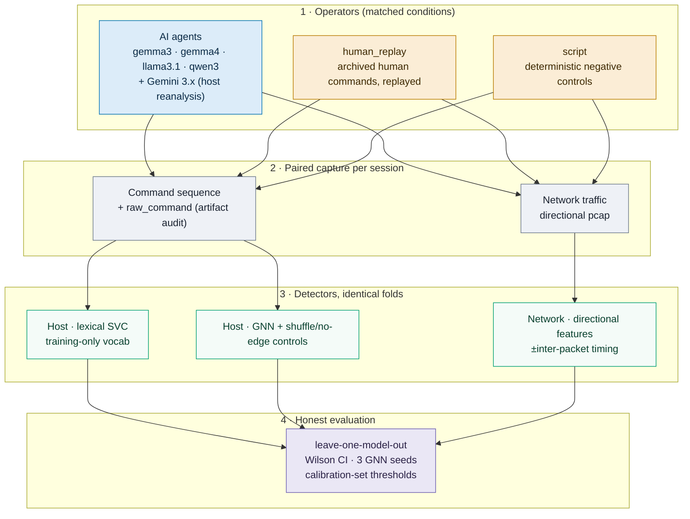

<h1 align="center">AI-Attack IDS</h1>
<p align="center"><b>Can a detector tell whether the operator behind a shell session is an AI agent — from behavior alone?</b></p>

<p align="center">
  <a href="#-english"></a>
  <a href="#-türkçe"></a>
</p>

<p align="center">
  
  
  
  
</p>

<p align="center">
  <a href="experiments/RESULTS_V2.md"></a>
  <a href="experiments/PROTOCOL.md"></a>
</p>

> **This is a corrected research pilot, not a deployment validation.** Earlier headline
> numbers (a universal 1.00 ensemble floor, an "intrinsic" state-verification reflex,
> a 0.962 origin F1) were inflated by driver artifacts, preprocessing leakage, and
> treating command *replay* as live human participation. This README describes the
> corrected study. The full per-fold tables are in
> **[experiments/RESULTS_V2.md](experiments/RESULTS_V2.md)**; the method is in
> **[experiments/PROTOCOL.md](experiments/PROTOCOL.md)**; the still-required live-human
> follow-up is in **[experiments/HUMAN_STUDY.md](experiments/HUMAN_STUDY.md)**. The
> superseded historical write-up is preserved in git history and in `report.html`.

---

<details open id="-english">
<summary><h2>🇬🇧 English</h2></summary>

### The question

> *"Can we build an IDS that tells whether an incoming attack is driven by an AI agent rather than a human or a script, no matter which model is behind it?"*

This is not model attribution — we are not asking *which* LLM this is, only whether the operator behind the session is a language model at all. We answer it by fingerprinting behavior over the command sequence and the network traffic, and the crucial tests are whether that fingerprint holds for models the detector has never seen, and whether it survives once known confounds are removed.

### What the corrected evaluation changed

The first pass reached very high numbers by accident. The corrected pipeline (`scripts/*_v2.py`, `harness/lab/*_v2.py`, `experiments/`) fixes the causes and re-measures honestly:

- **Driver substitutions removed.** The harness used to inject flags into model commands (`nmap → nmap -T4 …`, `ping → ping -c 3`, `ssh → ssh -o BatchMode=yes …`). **337 of 3,215** recorded malicious/evasion commands were such substitutions, not model-authored. The corrected host analysis recovers the model's actual command from `raw_command` and scores on that.
- **Replay is labelled as replay.** The "human" negatives are *archived human commands replayed by a program*, not live participants choosing commands against the same outputs. This is kept as an explicit, separate label (`human_replay`), never relabelled as `human`.
- **Directional network features.** Ports/IPs/SYNs use outbound traffic only; the received-RST fraction uses inbound only; SSH transport direction follows the first TCP SYN, not port order. (Legacy captures dropped all port-22 traffic — that information is simply gone.)
- **Training-only preprocessing.** The common command vocabulary, TF-IDF and scalers are fit on training data only, after a 20-command cap, with network commands removed (`scripts/eval_common.py`).
- **Honest uncertainty.** Session recall/FPR with Wilson intervals; the GNN is run with three seeds (17/42/73) and reported as a min–max range, *not* a confidence interval; FPR thresholds are picked only on a held-out calibration set.
- **Paired host + network capture.** A new lab collector records commands *and* pcap for every session, for AI, replay and scripts, under matched conditions.

### Host layer: does the command signature generalize to unseen models?

Leave-one-model-out on the corrected host data — each AI model fully held out of training, tested against held-out MUNI human groups, first-20-command cap, training-only shared vocabulary, network commands removed:

| held-out model | AI n | SVC recall | SVC 95% Wilson | SVC FPR | GNN recall (3 seeds) | ensemble (3 seeds) |
|---|---:|---:|---|---:|---|---|
| gemini-3.1-pro | 14 | 0.857 | 0.601–0.960 | 0.050 | 0.571–0.786 | 0.857 |
| gemini-3.5-flash | 49 | 0.939 | 0.835–0.979 | 0.050 | 0.959 | 0.959 |
| gemma3 | 24 | 0.708 | 0.508–0.851 | 0.025 | 0.583–0.625 | 0.792–0.833 |
| gemma4 | 23 | 0.783 | 0.581–0.903 | 0.025 | 0.565–0.696 | 0.783–0.826 |
| llama3.1 | 23 | 0.913 | 0.732–0.976 | 0.025 | 0.783–0.870 | 0.957–1.000 |
| qwen3 | 8 | 1.000 | 0.676–1.000 | 0.050 | 0.875–1.000 | 1.000 |

**There is no universal 1.00 floor.** A held-out model is recognized well above chance (lexical SVC recall 0.71–1.00 at 2.5–5% human FPR), which is a real, if modest-sample, signal — but the Wilson intervals are wide, and the two Gemini models come from one provider, so they are not two independent frontier families.

### The graph does not clearly earn its keep

Averaged over the model folds (equal weight per fold):

| method | mean recall | mean human FPR |
|---|---:|---:|
| lexical SVC | **0.867** | 0.037 |
| category-frequency logistic | 0.801 | 0.079 |
| GNN (topology, seed 42) | 0.758 | 0.071 |
| GNN with **shuffled** command order | 0.799 | 0.104 |
| GNN with **edges removed** | 0.785 | 0.067 |
| OR-ensemble (SVC ∪ GNN) | 0.913 | 0.087 |

The lexical SVC alone (0.867) beats the graph (0.758), and shuffling the command order or deleting the edges barely changes the GNN — so a high ensemble number does **not** demonstrate that transition *topology* is what carries the signal. The ensemble's 0.913 is mostly the SVC. We report the SVC as the honest primary detector and the graph as an inconclusive control.

### The state-verification tendency is real but partly prompted

LLM agents re-query their context (`pwd`, `whoami`, `id`, `uname`, `hostname`) far more than the human recordings do. But the historical prompts *explicitly told the model to run `pwd` as a fallback*, so this is not proven to be an intrinsic, prompt-free property. In the corrected count, state-check commands drop from **840 recorded to 503** once driver substitutions are removed — the tendency survives that correction, but a `no_state` ablation (removing those five tokens from the vocabulary) drops SVC recall substantially (e.g. gemma3 0.71→0.50, qwen 1.00→0.13), showing the detector leans on it. A prompt-free, live-human replication is still outstanding.

### Adaptive evasion and other host controls

Under a white-box prompt that instructs the agent to suppress the reflex (`evade_recon`/`evade_exploit`), the state-check share collapses, but the lexical detector's response is model-dependent (`experiments/host_v2.json`): e.g. `evasion:gemma4` SVC recall 1.00, `evasion:llama` 0.67, `evasion:gemma3` 0.75. Retraining on evasive traffic recovers some models and not others. This is an arms-race signal on a small sample, not a solved problem — and suppressing all useful reconnaissance must not be counted as successful evasion.

### Network layer

- **Legacy reanalysis (preprocessing ablation, not generalization).** The same 14 legacy pcaps (8 AI, 6 replay), a Random Forest, and an out-of-session split give macro F1 **0.785** with the old features and **0.714** after the traffic-direction fix. Legacy captures excluded port-22 traffic, so this can only be a preprocessing control.
- **New paired lab.** On the 48 paired sessions, network features (especially with inter-packet **timing**) separate AI from replay strongly (host+network F1 up to 1.00). But this runs on a **loopback** lab with no realistic latency or loss, the replay negatives are not live humans, and the AI's constrained port budget differs from the replay's original task — so this is not a human-vs-AI field result. Timing carries most of the separation; without it the network signal is weaker and confounded by tool/scan-budget choices.
- **HASSH** (SSH client fingerprint) identifies a *programmatic client* (paramiko vs OpenSSH), which also covers Ansible/CI; no new AI-origin validation was done for it.

### Task coverage — some agents barely act

Coverage = share of expected open services that returned a SYN+ACK during the session (`scripts/score_task_v2.py`). It does not prove comprehension or exploitation, but it separates real reconnaissance from agents that stall:

| operator | sessions | mean open-service coverage | commands run | timeouts |
|---|---:|---:|---:|---:|
| gemma3:4b | 8 | 0.411 | 48 | 15 |
| gemma4:latest | 8 | 1.000 | 43 | 0 |
| llama3.1:8b | 8 | 1.000 | 37 | 3 |
| **qwen3:4b** | 8 | **0.000** | **0** | 0 |
| human_replay | 12 | 0.892 | 72 | 4 |
| script | 4 | 0.240 | 18 | 0 |

`qwen3:4b` emits no usable commands here, so any "detection" of it is detection of an empty session.

### Intent axis (malicious vs benign)

Across all corpora, leave-one-group-out macro F1 is **0.896**; within AI only, leave-one-model-out is **0.785** (`experiments/intent_v2.json`). This is **descriptive corpus classification, not independent evidence of malice**: MUNI and Schonlau are different sources and eras, and the labels come from the assigned task, not from proven harm. A permuted-label control cannot remove that provenance confound. A live, matched-task benign/malicious human study is required before any intent claim.

### Honest limitations

- **The human class is replay, not live participation.** Every "human" negative is a program replaying archived commands. The study is not complete until live participants choose commands from the same task instructions and outputs (see [HUMAN_STUDY.md](experiments/HUMAN_STUDY.md)).
- **The sample is a pilot.** 48 new paired sessions ({ai: 32, replay: 12, script: 4}, 8 zero-traffic AI kept, 2 collector errors excluded); the legacy host/network sets are similarly small. Wilson intervals do not model session dependence or training variance.
- **No validated low FPR.** Thresholds are picked on 80 calibration humans; with 40 test humans the FPR resolution is 2.5%. A 1% population FPR is **not** demonstrated — with zero observed false positives, the one-sided 95% bound clears 1% only near ~299 independent negatives.
- **The graph's contribution is unproven** (shuffle/no-edge controls ≈ the real graph).
- **The two frontier models are one provider.** Gemini-3.1-pro / 3.5-flash are not independent families; the pro model was also heavily API-rate-limited (small n).
- **The network result is loopback and confounded.** No realistic jitter/loss; replay ≠ human; scan-budget mismatch. Timing dominates the separation.
- **Environment/context "variants" are one driver.** The two service profiles and two context policies are configurations of the same collector, not independent agent frameworks.
- **Open work:** live matched-task humans, independently-implemented agents, broader tasks/environments, adaptive evasion that preserves task success, a real network-impairment experiment, and independent field testing.

### Architecture



### Reproduce

Python 3.11 was used. Raw sessions and pcaps stay in git-ignored directories; the `experiments/*.json` files preserve per-fold predictions, IDs and parameters.

```sh
python3.11 -m venv .venv
.venv/bin/pip install -r experiments/requirements-lock.txt
.venv/bin/python -m unittest discover -s tests -v
.venv/bin/python harness/lab/recon_features.py --output experiments/network_features_v2.json
.venv/bin/python scripts/evaluate_host_v2.py       # corrected host leave-one-model-out
.venv/bin/python scripts/evaluate_intent_v2.py     # intent (descriptive corpus classification)
.venv/bin/python harness/lab/collect_v2.py         # new paired host+pcap collection (needs Docker lab)
.venv/bin/python harness/lab/counterfactual_v2.py  # replay AI trajectories as scripts
.venv/bin/python scripts/evaluate_network_v2.py    # directional network + combined layers
.venv/bin/python scripts/score_task_v2.py          # task-coverage / execution audit
.venv/bin/python scripts/summarize_v2.py           # regenerate experiments/RESULTS_V2.md
```

Collection needs Docker images `lab-attacker:latest` / `lab-target:latest`, the four local Ollama models, and the lab subnet free.

### Repository layout

```
harness/
  driver.py              LLM -> SSH loop; no synthetic pwd/nmap recovery is injected
  lab/
    collect_v2.py        paired host+pcap collector (matched conditions)
    counterfactual_v2.py replay an AI trajectory as a script (source vs operator)
    recon_features.py    directional network feature extraction
    retry_capture_v2.py  capture retry helper
scripts/
  eval_common.py             shared contract: training-only vocab, Wilson intervals
  evaluate_host_v2.py        corrected host leave-one-model-out + graph controls
  evaluate_network_v2.py     directional network + host/network/combined folds
  evaluate_intent_v2.py      intent as descriptive corpus classification
  ablate_artifacts_v2.py     single-variable driver-substitution ablation
  score_task_v2.py           open-service coverage + execution audit
  summarize_v2.py            writes experiments/RESULTS_V2.md
  ids_data.py                shared session loader
tests/test_protocol_v2.py    protocol invariants
experiments/
  RESULTS_V2.md   corrected results (authoritative)      PROTOCOL.md  method
  HUMAN_STUDY.md  required live-human follow-up
  host_v2.json · network_v2.json · intent_v2.json · artifact_ablation_v2.json
  task_coverage_v2.json · paired_manifest.json · runtime_manifest.json · requirements-lock.txt
report.html      bilingual HTML report (corrected summary + archived historical report)
```

### Data sources

| dataset | role | link |
|---|---|---|
| **MUNI shell commands** | real human commands (replayed as negatives) | [Zenodo 8136017](https://zenodo.org/records/8136017) (CC-BY-4.0) |
| **DTU "Honey for the Agent"** | malicious+AI reference, deception design | [Zenodo 20818246](https://zenodo.org/records/20818246) (CC-BY-4.0) |
| **Schonlau SEA** | real benign human command streams (intent corpus) | [schonlau.net](https://www.schonlau.net/intrusion.html) |
| **Gemini 3.x API** | frontier AI host sessions (gemini-3.1-pro, gemini-3.5-flash) | [ai.google.dev](https://ai.google.dev) |
| **TRACE** | fingerprinting-pipeline reference | [arXiv 2605.01186](https://arxiv.org/abs/2605.01186) |

</details>

---

<details id="-türkçe">
<summary><h2>🇹🇷 Türkçe</h2></summary>

### Soru

> *"Sisteme gelen bir saldırının, arkasındaki model ne olursa olsun, bir insan ya da script yerine bir AI ajanı tarafından sürüldüğünü ayırt eden bir IDS kurabilir miyiz?"*

Bu, model atıfı değil — *hangi* LLM olduğunu değil, operatörün bir dil modeli olup olmadığını soruyoruz. Yanıtı komut dizisi ve ağ trafiği üzerinden davranışı parmak izleyerek veriyoruz; kritik sınavlar, imzanın hiç görülmemiş modellere genelleşip genelleşmediği ve bilinen confound'lar kaldırıldığında ayakta kalıp kalmadığı.

### Düzeltilmiş değerlendirme neyi değiştirdi

İlk turda sayılar kazara çok yüksek çıkmıştı. Düzeltilmiş boru hattı (`scripts/*_v2.py`, `harness/lab/*_v2.py`, `experiments/`) nedenleri düzeltip dürüstçe yeniden ölçüyor:

- **Sürücü dönüşümleri kaldırıldı.** Harness eskiden model komutlarına bayrak enjekte ediyordu (`nmap → nmap -T4 …`, `ping → ping -c 3`, `ssh → ssh -o BatchMode=yes …`). Kayıtlı 3.215 malicious/evasion komutunun **337**'si böyle dönüşümdü, model yazımı değil. Düzeltilmiş host analizi modelin gerçek komutunu `raw_command`'dan geri alıp onu skorluyor.
- **Replay, replay olarak etiketlendi.** "İnsan" negatifleri, canlı katılımcı değil, *arşivlenmiş insan komutlarının bir programca oynatılmasıdır* (`human_replay`); asla `human` diye yeniden etiketlenmez.
- **Yönlü ağ özellikleri.** Portlar/IP'ler/SYN'ler yalnız giden trafik; alınan-RST oranı yalnız gelen trafik; SSH taşıma yönü port sırası değil ilk TCP SYN'e göre. (Eski yakalamalar port-22 trafiğini attı — o bilgi kayıp.)
- **Yalnız-eğitimde ön işleme.** Ortak komut sözlüğü, TF-IDF ve ölçekleyiciler yalnız eğitim verisinde, 20-komut sınırından sonra, ağ komutları çıkarılarak fit edilir (`scripts/eval_common.py`).
- **Dürüst belirsizlik.** Wilson aralıklı oturum recall/FPR; GNN üç tohumla (17/42/73) koşulur ve güven aralığı değil min–max aralığı olarak verilir; FPR eşikleri yalnız ayrık bir calibration setinde seçilir.
- **Eşlenmiş host + ağ yakalaması.** Yeni bir lab toplayıcı her oturum için komut *ve* pcap kaydeder; AI, replay ve script için eş koşullarda.

### Host katmanı: komut imzası görülmemiş modellere genelleşiyor mu?

Düzeltilmiş host verisinde leave-one-model-out — her AI modeli eğitimden tamamen çıkarılır, dışarıda tutulan MUNI insan gruplarına karşı test edilir, ilk-20-komut sınırı, yalnız-eğitimden ortak sözlük, ağ komutları çıkarılmış:

| dışarıda tutulan model | AI n | SVC recall | SVC %95 Wilson | SVC FPR | GNN recall (3 tohum) | ensemble (3 tohum) |
|---|---:|---:|---|---:|---|---|
| gemini-3.1-pro | 14 | 0.857 | 0.601–0.960 | 0.050 | 0.571–0.786 | 0.857 |
| gemini-3.5-flash | 49 | 0.939 | 0.835–0.979 | 0.050 | 0.959 | 0.959 |
| gemma3 | 24 | 0.708 | 0.508–0.851 | 0.025 | 0.583–0.625 | 0.792–0.833 |
| gemma4 | 23 | 0.783 | 0.581–0.903 | 0.025 | 0.565–0.696 | 0.783–0.826 |
| llama3.1 | 23 | 0.913 | 0.732–0.976 | 0.025 | 0.783–0.870 | 0.957–1.000 |
| qwen3 | 8 | 1.000 | 0.676–1.000 | 0.050 | 0.875–1.000 | 1.000 |

**Evrensel 1.00 taban yoktur.** Dışarıda tutulan model şanstan belirgin yüksek tanınıyor (sözcüksel SVC recall 0.71–1.00, %2.5–5 insan FPR) — gerçek ama küçük-örneklemli bir sinyal — ancak Wilson aralıkları geniş ve iki Gemini modeli tek sağlayıcıdan geliyor, yani bağımsız iki frontier aile değiller.

### Grafik hakkını vermiyor

Model foldları üzerinde ortalama (fold başına eşit ağırlık):

| yöntem | ortalama recall | ortalama insan FPR |
|---|---:|---:|
| sözcüksel SVC | **0.867** | 0.037 |
| kategori-frekansı lojistik | 0.801 | 0.079 |
| GNN (topoloji, tohum 42) | 0.758 | 0.071 |
| GNN **sırası karıştırılmış** | 0.799 | 0.104 |
| GNN **kenarları çıkarılmış** | 0.785 | 0.067 |
| OR-topluluğu (SVC ∪ GNN) | 0.913 | 0.087 |

Sözcüksel SVC tek başına (0.867) grafiği (0.758) geçiyor; komut sırasını karıştırmak veya kenarları silmek GNN'i çok az değiştiriyor — yani yüksek topluluk sayısı, sinyali *topolojinin* taşıdığını **kanıtlamıyor**. Topluluğun 0.913'ü çoğunlukla SVC. Dürüst birincil dedektör olarak SVC'yi, grafiği ise sonuçsuz bir kontrol olarak raporluyoruz.

### Durum-yoklama eğilimi gerçek ama kısmen promptlu

LLM ajanları bağlamı (`pwd`, `whoami`, `id`, `uname`, `hostname`) insan kayıtlarından çok daha fazla yeniden sorguluyor. Ama tarihsel promptlar modele *`pwd`'yi fallback olarak çalıştırmasını açıkça söylüyordu*, dolayısıyla bunun içsel, promptsuz bir özellik olduğu kanıtlanmış değil. Düzeltilmiş sayımda durum-kontrol komutları, sürücü dönüşümleri çıkınca **840'tan 503'e** düşüyor — eğilim bu düzeltmeden sağ çıkıyor, ama bir `no_state` ablation'ı (bu beş token'ı sözlükten çıkarmak) SVC recall'ını belirgin düşürüyor (ör. gemma3 0.71→0.50, qwen 1.00→0.13), yani dedektör buna yaslanıyor. Promptsuz, canlı-insan replikasyonu hâlâ eksik.

### Adaptif kaçınma ve diğer host kontrolleri

Ajana refleksi bastırmasını söyleyen beyaz-kutu prompt altında (`evade_recon`/`evade_exploit`), durum-kontrol payı çöküyor, ama sözcüksel dedektörün tepkisi modele bağlı (`experiments/host_v2.json`): ör. `evasion:gemma4` SVC recall 1.00, `evasion:llama` 0.67, `evasion:gemma3` 0.75. Kaçınma trafiğiyle yeniden eğitim bazı modelleri kurtarıyor, bazılarını değil. Bu, küçük örneklemde bir silahlanma-yarışı sinyali; çözülmüş bir problem değil — ve tüm yararlı keşfi bastırmak "başarılı kaçınma" sayılmamalı.

### Ağ katmanı

- **Eski yeniden analiz (ön-işleme ablation'ı, genelleme değil).** Aynı 14 eski pcap (8 AI, 6 replay), bir Random Forest ve oturum-dışı split, eski özelliklerle macro F1 **0.785**, yön düzeltmesinden sonra **0.714** veriyor. Eski yakalamalar port-22'yi dışladığı için bu yalnız bir ön-işleme kontrolü olabilir.
- **Yeni eşlenmiş lab.** 48 eşlenmiş oturumda ağ özellikleri (özellikle paketler-arası **zamanlama** ile) AI'yı replay'den güçlü ayırıyor (host+ağ F1 1.00'a kadar). Ama bu, gerçekçi gecikme/kayıp olmayan bir **loopback** labda çalışıyor, replay negatifleri canlı insan değil ve AI'nın dar port bütçesi replay'in özgün görevinden farklı — yani bu bir insan-vs-AI saha sonucu değil. Ayrımı çoğunlukla zamanlama taşıyor; onsuz ağ sinyali zayıf ve araç/tarama-bütçesi seçimleriyle karışık.
- **HASSH** (SSH istemci parmak izi) bir *programatik istemci* (paramiko vs OpenSSH) tanımlıyor, ki Ansible/CI de buna dahil; bunun için yeni bir AI-köken doğrulaması yapılmadı.

### Görev kapsamı — bazı ajanlar neredeyse hiç iş yapmıyor

Kapsam = oturum boyunca SYN+ACK dönen beklenen açık servislerin oranı (`scripts/score_task_v2.py`). Anlama veya exploit'i kanıtlamaz, ama gerçek keşfi tıkanan ajanlardan ayırır:

| operatör | oturum | ortalama açık-servis kapsamı | çalıştırılan komut | timeout |
|---|---:|---:|---:|---:|
| gemma3:4b | 8 | 0.411 | 48 | 15 |
| gemma4:latest | 8 | 1.000 | 43 | 0 |
| llama3.1:8b | 8 | 1.000 | 37 | 3 |
| **qwen3:4b** | 8 | **0.000** | **0** | 0 |
| human_replay | 12 | 0.892 | 72 | 4 |
| script | 4 | 0.240 | 18 | 0 |

`qwen3:4b` burada kullanılabilir komut üretmiyor; onun "tespiti" boş bir oturumun tespitidir.

### Niyet ekseni (zararlı vs zararsız)

Tüm korpuslarda leave-one-group-out macro F1 **0.896**; yalnız AI içinde leave-one-model-out **0.785** (`experiments/intent_v2.json`). Bu **betimsel korpus sınıflandırması, bağımsız kötü-niyet kanıtı değildir**: MUNI ile Schonlau farklı kaynak ve dönemlerdir ve etiketler verilen görevden gelir, kanıtlı zarardan değil. Permüte-etiket kontrolü bu köken confound'unu kaldıramaz. Herhangi bir niyet iddiasından önce canlı, eş görevli insan çalışması gerekir.

### Dürüst sınırlamalar

- **İnsan sınıfı replay'dir, canlı katılım değil.** Her "insan" negatifi, arşivlenmiş komutları oynatan bir programdır. Canlı katılımcılar aynı görev talimatı ve çıktılardan komut seçene dek çalışma tamamlanmış sayılmaz ([HUMAN_STUDY.md](experiments/HUMAN_STUDY.md)).
- **Örneklem bir pilot.** 48 yeni eşlenmiş oturum ({ai: 32, replay: 12, script: 4}, 8 sıfır-trafik AI tutuldu, 2 collector hatası dışlandı); eski host/ağ setleri de küçük. Wilson aralıkları oturum bağımlılığını ve eğitim varyansını modellemez.
- **Doğrulanmış düşük FPR yok.** Eşikler 80 calibration insanında seçilir; 40 test insanıyla FPR çözünürlüğü %2.5. %1 popülasyon FPR'si **gösterilmedi** — sıfır yanlış-pozitifle tek-taraflı %95 sınır %1'in altına ancak ~299 bağımsız negatifte iner.
- **Grafiğin katkısı kanıtlanmadı** (karıştırma/kenarsız kontroller ≈ gerçek grafik).
- **İki frontier model tek sağlayıcı.** Gemini-3.1-pro / 3.5-flash bağımsız aileler değil; pro model ayrıca ağır API rate-limit yedi (küçük n).
- **Ağ sonucu loopback ve confound'lu.** Gerçekçi jitter/kayıp yok; replay ≠ insan; tarama-bütçesi uyumsuz. Ayrımı zamanlama baskılıyor.
- **Ortam/bağlam "varyantları" tek sürücü.** İki servis profili ve iki bağlam politikası aynı toplayıcının konfigürasyonları, bağımsız ajan frameworkleri değil.
- **Açık işler:** canlı eş-görevli insanlar, bağımsız uygulanmış ajanlar, daha geniş görev/ortamlar, görev başarısını koruyan adaptif kaçınma, gerçek ağ-bozunumu deneyi, bağımsız saha testi.

### Mimari, tekrar üretim, depo yapısı, veri kaynakları

Mimari diyagramı, çalıştırma komutları, dosya düzeni ve veri kaynakları için yukarıdaki İngilizce bölüme bakın; tüm sayısal ayrıntılar **[experiments/RESULTS_V2.md](experiments/RESULTS_V2.md)** ve **[experiments/PROTOCOL.md](experiments/PROTOCOL.md)** içindedir.

</details>

---

<p align="center"><sub>Local open-weight models (Ollama) + Docker · isolated lab · corrected research pilot · research and defensive use only</sub></p>
