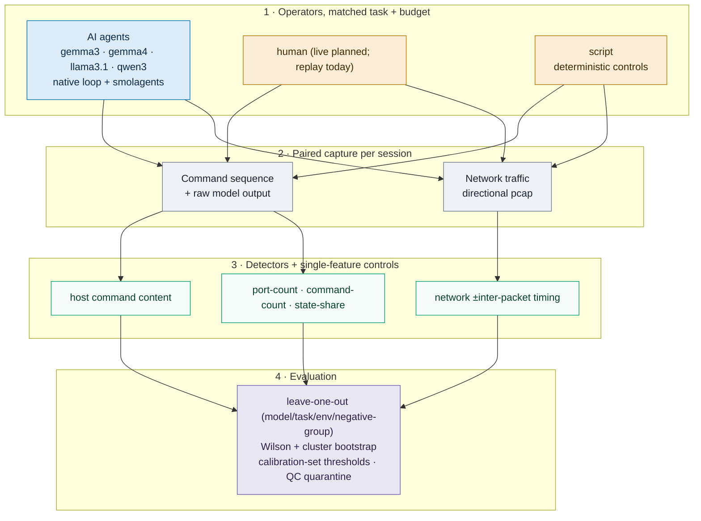

<h1 align="center">AI-Attack IDS</h1>
<p align="center"><b>Can a detector tell whether the operator behind a shell session is an AI agent — from behavior alone, once task and budget are equalized?</b></p>

<p align="center">
  <a href="#-english"></a>
  <a href="#-türkçe"></a>
</p>

<p align="center">
  
  
  
  
</p>

> A research pilot. Method: **[experiments/PROTOCOL.md](experiments/PROTOCOL.md)** ·
> full result tables: **[experiments/MATCHED_RESULTS.md](experiments/MATCHED_RESULTS.md)** ·
> required live-human follow-up: **[experiments/HUMAN_STUDY.md](experiments/HUMAN_STUDY.md)** ·
> technical report: **[REPORT.md](REPORT.md)** (bilingual).

---

<details open id="-english">
<summary><h2>🇬🇧 English</h2></summary>

### The question

> *"Can we build an IDS that tells whether an incoming attack is driven by an AI agent rather than a human or a script, no matter which model is behind it?"*

This is not model attribution — we are not asking *which* LLM this is, only whether the operator is a language model at all. The whole design is built to keep that question from collapsing into an easier one: if the AI and the things it is compared against differ in their task, their tool budget, or their scan breadth, then a detector can separate them without learning anything about *agency*. So every operator is run under the same task and the same budget, and the signal is measured against deterministic automation, not only against a different human corpus.

### Study design

Every session is captured two ways at once — the command sequence and a directional pcap — for three operator classes on the same isolated lab:

- **AI agents** — four local models (gemma3, gemma4, llama3.1, qwen3) driven by two independent scaffolds: our own agent loop and the upstream `smolagents` tool-calling agent.
- **`script`** — deterministic automations across eight families (nmap/nc/curl/`/dev/tcp` variants), the negative controls.
- **`human_live`** — live participants choosing commands from the same instructions and outputs. The consent/collection package is ready; **no participant data has been collected**, so the human negatives available today are *replayed* archived commands (`human_replay`), which is not the same as a live decision.

Every operator receives the **same instructions, the same six in-scope ports, and the same six-command budget**, so scan breadth cannot substitute for origin. The evaluation contract (`scripts/eval_common.py`) fits the vocabulary, TF-IDF and scalers on training data only; holds out whole AI models, tasks, environments, and negative source-groups; picks false-positive thresholds only on a separate calibration set; reports Wilson intervals and a group-resampling cluster bootstrap; and quarantines sessions whose capture is incomplete rather than scoring them.

### What command and network behavior reveal, against automation

Leave-one-model-out, each held-out AI model versus deterministic scripts under the matched budget, with a **wide negative pool of 16 independent script families** (so each calibration/test split holds several independent families). AUROC is threshold-free; the recall/FPR pair is at a threshold calibrated for 5% FPR on held-out negatives. Full per-method tables and the generator: [experiments/MATCHED_RESULTS.md](experiments/MATCHED_RESULTS.md).

| detector | AUROC | recall @cal-5% | test FPR |
|---|---:|---:|---:|
| port count only *(control)* | 0.61 | 0.23 | 0.00 |
| command count only *(control)* | 0.77 | 0.00 | 0.00 |
| state-check share only *(control)* | 0.50 | 0.00 | 0.00 |
| host command-name TF-IDF | 0.87 | 0.24 | 0.00 |
| network SVC, with timing | **0.92** | 0.82 | **0.01** |
| network RF, with timing | 0.94 | 0.51 | 0.00 |
| host + network, with timing | **0.95** | 0.72 | **0.00** |

Reading:
- The single-feature controls show the budget is genuinely matched — **port count** alone reaches only AUROC 0.61 (no scan-breadth shortcut) — while **command count** reaches 0.77, so command *volume* remains a partial confound, and **state-check share** is 0.50 because those tokens (`pwd`/`id`/`whoami`/`uname`/`hostname`) never appear in these matched sessions (a constant feature, not "a script and an LLM look alike").
- The **host command-name TF-IDF** baseline reaches AUROC 0.87 but its recall at a 5%-calibrated threshold is only 0.24, and it is unstable across splits (it inverts on some) — the feature is only the first token of the first six commands. It is a weak, unstable signal, not a reliable detector.
- **Network and combined models separate AI from automation and hold a low test false-positive rate** across the wide negative pool of independent families: network+timing AUROC 0.92 at 0.01 FPR (recall 0.82), host+network+timing 0.95 at 0.00 FPR. This is not yet a *validated* low FPR for deployment — each split still has only tens of negatives (wide exact FP bounds), the negatives are deterministic automation rather than live humans, and cluster intervals are wide.

### Identical commands, different operator

The sharpest control replays an AI session's exact commands as a script and asks the detector to tell them apart. Command-name features tie by construction (a consistency check); only timing adds separation (network-with-timing AUROC ~0.71, RF-with-timing ~0.83, averaged over 13 two-sample folds), and local-model inference waits versus wait-free replay are an expected timing difference — so this is "timing adds separation under these conditions," not an established AI-specific signal. "Did an AI write this command?" and "is an AI deciding online right now?" remain different questions.

### Evasion, matched WAN impairment, and a frozen test

- **Evasion:** of 32 attempts (30 eligible), **9 still produce the exact correct answer** (gemma4 6, llama 2, qwen 1) — several models complete the task. The state-check share does not "collapse": those tokens are zero in the normal condition too. Two evasion sessions blew the port budget (~1000 ports), recorded and excluded from matched-budget claims. Detection holds under evasion (network+timing AUROC 0.97, FPR 0.01).
- **Matched WAN impairment:** an emulated netem profile — delay 80ms±40ms, 1.5% correlated loss, 5% reordering — is applied to **both** AI and scripts (16 impaired AI, 32 impaired scripts) and evaluated impaired-vs-impaired. The separation survives (RF+timing AUROC 0.96, recall 0.81, 0 FP). It is emulation on a single Docker host, **not** a real wide-area network.
- **Frozen confirmatory test:** with the detector and threshold frozen on development, a held-out set of **unseen tasks, unseen service profiles and 4 reserved negative families** is scored once — network+timing and host+network reach 0/16 false positives (AUROC 0.86–0.89), RF+timing AUROC 1.00. Encouraging generalization, but 16 negatives still leave a wide exact FP bound.

### Against archived human command corpora

Compared against a *different* human corpus (archived cyber-range command logs) rather than automation, the command signal looks much stronger — leave-one-model-out recall 0.71–1.00 — but that comparison also carries the corpus, era, task and installed-tool differences between the two data sources, so it measures those as much as agency. A graph model over the command-transition topology does not beat the lexical baseline here (shuffling the order or removing the edges barely changes it), so the extra structure is not where any signal lives. This is why the controlled comparison is against automation under a matched budget.

### Intent (malicious vs benign)

Treated as a separate axis, task category separates at leave-one-group-out macro F1 **0.896** across corpora and **0.785** within the AI side. This is descriptive corpus classification, not evidence of malice: the corpora differ in source and era and the labels come from the assigned task, not from proven harm. No intent claim follows without a live, matched-task human study.

### Honest limitations

- **The human class is replay, not live participation** — the largest limitation. The result the question demands needs live participants choosing commands from the same task and outputs ([HUMAN_STUDY.md](experiments/HUMAN_STUDY.md)).
- **The sample is a pilot.** 253 attempts, 237 eligible (112 AI, 128 script across 16 families, 13 counterfactual; 16 quarantined). Every AI attempt is repeat 0 — many conditions, no independent repeats. Each split holds several negative families but still only tens of negatives, so a 1% population FPR cannot be shown (a zero-FP fold has a wide exact upper bound); cluster intervals are wide.
- **The signal is real but not deployment-validated.** Network and combined detectors reach AUROC ~0.92–0.95 at ~0–1% test FPR, survive matched impairment, and generalize on a frozen unseen test — but the negatives are deterministic automation, not live humans, and the FP resolution is coarse. The host command-name baseline is weak and unstable (AUROC 0.87 but recall 0.24, inverts on some splits).
- **Command volume is a partial confound** the matched budget does not fully remove (command-count control AUROC 0.77), and two evasion sessions exceeded the budget.
- **Four local open-weight models spanning three families** (gemma×2, llama, qwen), two agent scaffolds sharing one shell executor — not independent frontier families; a network-only defender does not see the commands captured inside the operator container.
- **Open work:** live matched-task humans, more independently-implemented agents, many more independent negatives, broader tasks/environments, and a realistic-network experiment.

### Architecture



### Reproduce

Python 3.11. Raw sessions and pcaps stay in git-ignored directories; result JSONs under `experiments/` preserve per-fold predictions, IDs and parameters. The exact command sequence, image digests and dependency lock are in **[experiments/PROTOCOL.md](experiments/PROTOCOL.md)**. Collection needs the Docker lab images, the four local Ollama models, and the lab subnet free.

### Repository layout

```
harness/       session drivers and the paired host+pcap lab collector
scripts/       host, network and intent evaluators; shared evaluation contract; loaders
experiments/   protocol, results, live-human plan, per-fold prediction JSON, runtime lock
tests/         protocol invariants
report.html    bilingual HTML report
```

### Data sources

| dataset | role | link |
|---|---|---|
| **MUNI shell commands** | archived human commands (replayed as negatives; intent corpus) | [Zenodo 8136017](https://zenodo.org/records/8136017) (CC-BY-4.0) |
| **DTU "Honey for the Agent"** | AI-attack reference, deception design | [Zenodo 20818246](https://zenodo.org/records/20818246) (CC-BY-4.0) |
| **Schonlau SEA** | real benign human command streams (intent corpus) | [schonlau.net](https://www.schonlau.net/intrusion.html) |
| **Gemini 3.x API** | frontier AI host sessions | [ai.google.dev](https://ai.google.dev) |
| **TRACE** | fingerprinting-pipeline reference | [arXiv 2605.01186](https://arxiv.org/abs/2605.01186) |

</details>

---

<details id="-türkçe">
<summary><h2>🇹🇷 Türkçe</h2></summary>

### Soru

> *"Sisteme gelen bir saldırının, arkasındaki model ne olursa olsun, bir insan ya da script yerine bir AI ajanı tarafından sürüldüğünü ayırt eden bir IDS kurabilir miyiz?"*

Bu, model atıfı değil — *hangi* LLM olduğunu değil, operatörün bir dil modeli olup olmadığını soruyoruz. Tüm tasarım, bu sorunun daha kolay bir soruya çökmesini engellemek için kurulu: AI ile karşılaştırıldığı şeyler görev, araç bütçesi veya tarama genişliğinde farklıysa, bir dedektör onları *ajans* hakkında hiçbir şey öğrenmeden ayırabilir. Bu yüzden her operatör aynı görev ve aynı bütçe altında çalışır, ve sinyal yalnız farklı bir insan korpusuna karşı değil, deterministik otomasyona karşı ölçülür.

### Çalışma tasarımı

Her oturum aynı anda iki biçimde yakalanır — komut dizisi ve yönlü bir pcap — aynı izole laboratuvarda üç operatör sınıfı için:

- **AI ajanları** — dört yerel model (gemma3, gemma4, llama3.1, qwen3), iki bağımsız iskele ile sürülür: kendi ajan döngümüz ve upstream `smolagents` araç-çağıran ajanı.
- **`script`** — sekiz aile boyunca deterministik otomasyonlar (nmap/nc/curl/`/dev/tcp` çeşitleri), negatif kontroller.
- **`human_live`** — aynı talimat ve çıktılardan komut seçen canlı katılımcılar. Onam/toplama paketi hazır; **katılımcı verisi toplanmadı**, dolayısıyla bugün mevcut insan negatifleri *oynatılmış* arşiv komutlarıdır (`human_replay`) — bu, canlı bir karar ile aynı şey değildir.

Her operatör **aynı talimatı, aynı altı kapsam-içi portu ve aynı altı-komut bütçesini** alır; böylece tarama genişliği kökenin yerine geçemez. Değerlendirme sözleşmesi (`scripts/eval_common.py`) sözlük/TF-IDF/ölçekleyicileri yalnız eğitim verisinde fit eder; AI modellerini, görevleri, ortamları ve negatif kaynak-gruplarını bütünüyle dışarıda tutar; yanlış-pozitif eşiklerini yalnız ayrı bir calibration setinde seçer; Wilson aralıkları ve grup-yeniden-örnekleyen bir cluster bootstrap raporlar; ve yakalaması eksik oturumları skorlamak yerine karantinaya alır.

### Komut ve ağ davranışı otomasyona karşı ne gösteriyor

Leave-one-model-out, her dışarıda tutulan AI modeli eşit bütçe altında deterministik scriptlere karşı, **16 bağımsız script ailesinden oluşan geniş bir negatif havuzuyla** (her calibration/test split'inde birkaç bağımsız aile). AUROC eşikten bağımsızdır; recall/FPR çifti %5 FPR için kalibre edilmiş eşiktedir. Tüm tablolar ve üretici: [experiments/MATCHED_RESULTS.md](experiments/MATCHED_RESULTS.md).

| dedektör | AUROC | recall @kal-%5 | test FPR |
|---|---:|---:|---:|
| yalnız port sayısı *(kontrol)* | 0.61 | 0.23 | 0.00 |
| yalnız komut sayısı *(kontrol)* | 0.77 | 0.00 | 0.00 |
| yalnız durum-kontrol payı *(kontrol)* | 0.50 | 0.00 | 0.00 |
| host komut-adı TF-IDF | 0.87 | 0.24 | 0.00 |
| ağ SVC, zamanlamalı | **0.92** | 0.82 | **0.01** |
| ağ RF, zamanlamalı | 0.94 | 0.51 | 0.00 |
| host + ağ, zamanlamalı | **0.95** | 0.72 | **0.00** |

Okuma:
- Tek-özellikli kontroller bütçenin eşit olduğunu gösteriyor — yalnız **port sayısı** AUROC 0.61 (tarama-genişliği kestirmesi yok) — **komut sayısı** 0.77'ye ulaşıyor (komut *hacmi* kısmi confound), ve **durum-kontrol payı** 0.50 çünkü o token'lar bu eşit oturumlarda hiç geçmiyor (sabit özellik).
- **Host komut-adı TF-IDF** AUROC 0.87 alıyor ama %5-kalibre eşikte recall'ı yalnız 0.24 ve split'ler arasında kararsız (bazılarında tersleniyor) — özelliği yalnız ilk altı komutun ilk kelimesi. Zayıf, kararsız bir sinyal, güvenilir bir dedektör değil.
- **Ağ ve birleşik modeller AI'yı otomasyondan ayırıyor ve geniş bağımsız-aile negatif havuzunda düşük test yanlış-pozitif oranı tutuyor**: ağ+zamanlama AUROC 0.92, %1 FPR (recall 0.82); host+ağ+zamanlama 0.95, %0 FPR. Bu henüz dağıtım için *doğrulanmış* düşük FPR değil — split başına hâlâ onlarca negatif (geniş exact FP sınırları), negatifler canlı insan değil otomasyon, ve cluster aralıkları geniş.

### Aynı komutlar, farklı operatör

En keskin kontrol, bir AI oturumunun tam komutlarını script olarak oynatıp dedektörden ayırt etmesini ister. Komut-adı özellikleri yapısı gereği eşitlenir (tutarlılık kontrolü); yalnız zamanlama ayrım ekliyor (ağ-zamanlamalı AUROC ~0.71, RF-zamanlamalı ~0.83, 13 iki-örnekli fold ortalaması), ve yerel-model beklemeleri ile beklemesiz replay beklenen bir fark — yani "bu koşullarda zamanlama ayrım ekliyor," AI'ya özgü kanıtlanmış bir sinyal değil.

### Kaçınma, eşit WAN bozunumu ve dondurulmuş test

- **Kaçınma:** 32 denemenin (30 uygun) **9'u tam doğru cevabı üretiyor** (gemma4 6, llama 2, qwen 1) — birkaç model tamamlıyor. Durum-kontrol payı "çökmüyor": normal koşulda da sıfır. İki oturum port bütçesini aştı (~1000 port), kayıtlı ve dışlanmış. Kaçınma altında tespit tutuyor (ağ+zamanlama AUROC 0.97, FPR 0.01).
- **Eşit WAN bozunumu:** emüle netem — gecikme 80ms±40ms, %1.5 korelasyonlu kayıp, %5 reordering — **hem** AI'ya **hem** scriptlere uygulandı (16 bozunmuş AI, 32 bozunmuş script), bozunmuş-vs-bozunmuş değerlendirildi. Ayrım hayatta kalıyor (RF+zamanlama AUROC 0.96, recall 0.81, 0 FP). Bu tek Docker host'ta emülasyon, **gerçek** bir WAN değil.
- **Dondurulmuş doğrulama testi:** dedektör ve eşik geliştirmede donduruldu; **görülmemiş görevler, görülmemiş servis profilleri ve 4 rezerve negatif aile**den oluşan tutulan set bir kez skorlandı — ağ+zamanlama ve host+ağ 0/16 yanlış-pozitif (AUROC 0.86–0.89), RF+zamanlama AUROC 1.00. Umut verici genelleme, ama 16 negatif hâlâ geniş bir exact FP sınırı bırakıyor.

### Arşiv insan komut korpuslarına karşı

Otomasyon yerine *farklı* bir insan korpusuna (arşivlenmiş cyber-range komut kayıtları) karşı, komut sinyali çok daha güçlü görünür — leave-one-model-out recall 0.71–1.00 — ama o karşılaştırma iki veri kaynağı arasındaki korpus, dönem, görev ve kurulu-araç farklarını da taşır, dolayısıyla ajans kadar bunları da ölçer. Komut-geçiş topolojisi üzerinde bir grafik model burada sözcüksel baseline'ı geçmiyor (sırayı karıştırmak veya kenarları çıkarmak onu neredeyse değiştirmiyor), yani ek yapı sinyalin yaşadığı yer değil. Kontrollü karşılaştırmanın eşit bütçe altında otomasyona karşı olmasının nedeni budur.

### Niyet (zararlı vs zararsız)

Ayrı bir eksen olarak, görev kategorisi korpuslar arasında leave-one-group-out macro F1 **0.896** ve AI içinde **0.785** ile ayrılıyor. Bu betimsel korpus sınıflandırmasıdır, kötü-niyet kanıtı değildir: korpuslar kaynak/dönem olarak farklı ve etiketler kanıtlı zarardan değil verilen görevden gelir. Canlı, eş görevli insan çalışması olmadan niyet iddiası çıkmaz.

### Dürüst sınırlamalar

- **İnsan sınıfı replay'dir, canlı katılım değil** — en büyük sınırlama. Sorunun gerektirdiği sonuç, aynı görev ve çıktılardan komut seçen canlı katılımcılar gerektirir ([HUMAN_STUDY.md](experiments/HUMAN_STUDY.md)).
- **Örneklem bir pilot.** 253 deneme, 237 uygun (112 AI, 16 aileye yayılan 128 script, 13 counterfactual; 16 karantina). Her AI denemesi repeat 0 — çok koşul, bağımsız tekrar yok. Her split birkaç negatif aile içeriyor ama hâlâ yalnız onlarca negatif, dolayısıyla %1 popülasyon FPR'si gösterilemez (sıfır-FP fold'un geniş bir exact üst sınırı var); cluster aralıkları geniş.
- **Sinyal gerçek ama dağıtım-doğrulaması yok.** Ağ ve birleşik dedektörler AUROC ~0.92–0.95'e, ~%0–1 test FPR ile ulaşıyor, eşit bozunumu atlatıyor ve dondurulmuş görülmemiş testte genelleşiyor — ama negatifler canlı insan değil otomasyon ve FP çözünürlüğü kaba. Host komut-adı baseline'ı zayıf ve kararsız (AUROC 0.87 ama recall 0.24, bazı split'lerde tersleniyor).
- **Komut hacmi, eşit bütçenin tam gideremediği kısmi bir confound** (komut-sayısı kontrolü AUROC 0.77) ve iki kaçınma oturumu bütçeyi aştı.
- **Üç aileye yayılan dört yerel açık-ağırlık model** (gemma×2, llama, qwen), tek shell yürütücüsü paylaşan iki iskele — bağımsız frontier aileler değil; yalnız-ağ savunucusu operatör konteynerinde yakalanan komutları görmez.
- **Açık işler:** canlı eş-görevli insanlar, daha fazla bağımsız uygulanmış ajan, çok daha fazla bağımsız negatif, daha geniş görev/ortamlar ve gerçekçi bir ağ deneyi.

### Mimari, tekrar üretim, depo yapısı, veri kaynakları

Yukarıdaki İngilizce bölüme bakın; yöntem ve komutlar **[experiments/PROTOCOL.md](experiments/PROTOCOL.md)**, tüm tablolar **[experiments/MATCHED_RESULTS.md](experiments/MATCHED_RESULTS.md)** içindedir.

</details>

---

<p align="center"><sub>Local open-weight models (Ollama) + Docker · isolated lab · research and defensive use only</sub></p>
