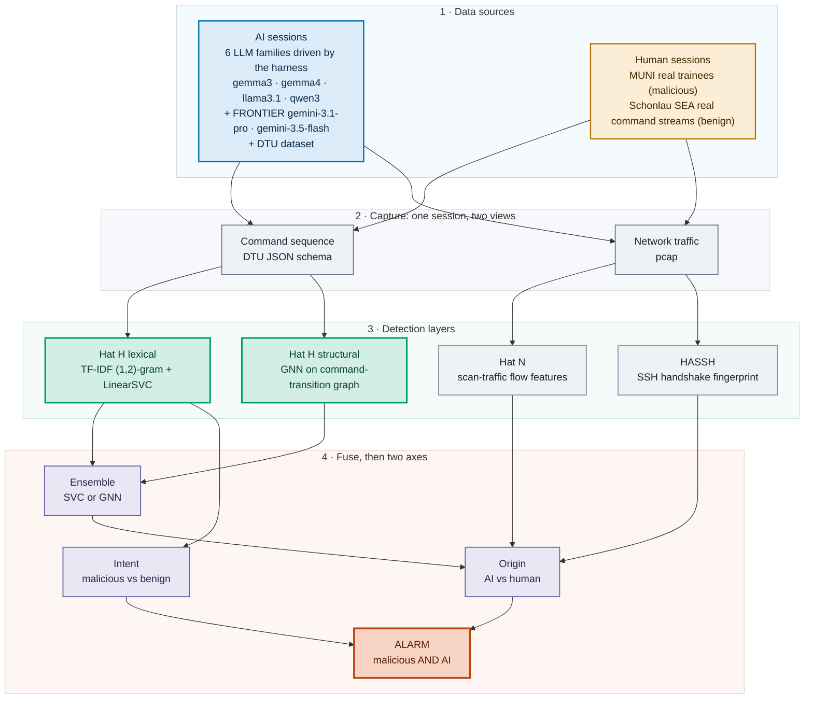
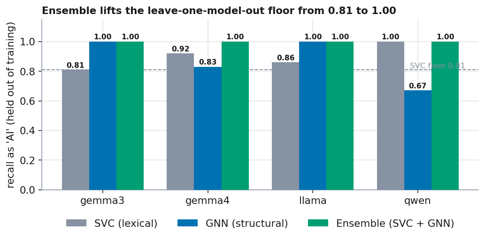
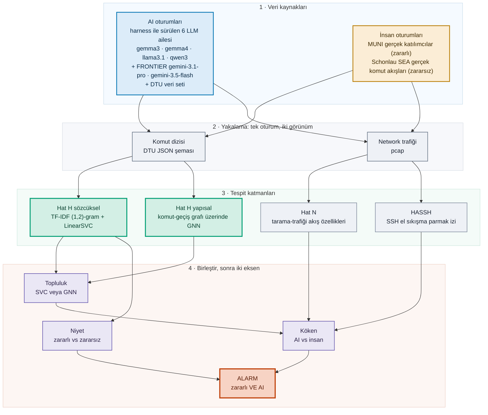

<h1 align="center">AI-Attack IDS</h1>
<p align="center"><b>Detecting LLM-driven attacks by behavioral fingerprinting.</b></p>

<p align="center">
  <a href="#-english"></a>
  <a href="#-türkçe"></a>
</p>

<p align="center">
  
  
  
  
  
  
  
</p>

<p align="center">
  <a href="REPORT.md"></a>
</p>

> This README gives the overview, architecture and findings. For the standalone write-up see **[REPORT.md](REPORT.md)** (bilingual). &nbsp;·&nbsp; Bu README genel bakış, mimari ve bulguları verir. Müstakil rapor için **[REPORT.md](REPORT.md)** (iki dilli).

---

<details open id="-english">
<summary><h2>🇬🇧 English</h2></summary>

### The question

> *"Can we build an IDS that tells whether an incoming attack is driven by an AI agent rather than a human or a script, no matter which model is behind it?"*

This is not model attribution. We are not asking *which* LLM this is. We are asking something more basic: is the operator behind the session a language model at all? We answer it by fingerprinting behavior, and the crucial test is whether that fingerprint still holds for models the detector has never seen.

### How it works: architecture

The pipeline has four stages. We **generate** attacker sessions (AI and human), **capture** each one as both a command sequence and network traffic, run several independent **detectors** over that capture, and combine their outputs on **two axes**, raising an alarm only where *malicious* meets *AI*.

The host-layer detector (Hat H) is itself two complementary models fused into an ensemble: a lexical one (TF-IDF + LinearSVC) and a structural one (a GNN over the command-transition graph).



**1 · Data sources.** The harness (`harness/driver.py`) drives four local LLMs through an SSH shell one command at a time, inside Docker environments (`harness/envs/`, `harness/lab/`), and records what they do. Human sessions come from public datasets: MUNI for real attackers, NL2Bash for benign admin work. Both the *origin* label (AI vs human) and the *intent* label (malicious vs benign) therefore come from the data's provenance, never from manual annotation.

**2 · Capture.** Every session is stored two ways: the **command sequence** in the DTU JSON schema (`scripts/adapt_dtu_to_trace.py` normalizes it) and the raw **network traffic** as a pcap (`harness/net/`, `harness/lab/`). That is what lets us compare a host-layer detector against a network-layer one on the *same* sessions.

**3 · Detection layers.** Hat H reads the command sequence and runs two models over it (lexical SVC and structural GNN). Hat N reads the outbound scan traffic. HASSH reads the SSH handshake. Each is evaluated separately in `scripts/`.

**4 · Fuse, then two axes.** Hat H's two models are combined into an ensemble, and origin and intent are learned as separate classifiers. The IDS raises an alarm only at their intersection, an autonomous malicious AI agent, which keeps legitimate automation (benign+AI) and ordinary attackers (malicious+human) out of the alert.

### Headline result: the signature generalizes to *frontier* families it has never seen

In a leave-one-**model**-out test, each AI model is pulled out of training entirely and then presented as an unknown actor. Even on the most unforgiving feature space we could build (44 shared command names, arguments stripped, session length equalized, network commands removed), an unseen LLM family is still flagged as "AI" by the lexical detector alone — and the two **frontier Gemini families**, which are *far* larger and more capable than the local training models, are caught **100 %** of the time despite never appearing in training.

| held-out family (SVC only, strict space) | recall | 95 % CI | note |
|---|---|---|---|
| gemma3:4b | 0.76 | [0.59, 0.90] | floor (small local) |
| llama3.1:8b | 0.87 | [0.67, 1.00] | |
| gemma4 | 0.95 | [0.85, 1.00] | |
| qwen3:4b | 1.00 | [1.00, 1.00] | n=3, weak |
| **gemini-3.1-pro** | **1.00** | [1.00, 1.00] | **frontier, never trained on** |
| **gemini-3.5-flash** | **1.00** | [1.00, 1.00] | **frontier, never trained on** |
| **floor / mean** | **0.76 / 0.93** | | |

This is the decisive test of the "is it a small-model artifact?" objection: it is not. The signal is not a "gemma signature," nor a "weak-model signature." It is an **LLM-agent signature**, shared across `gemma3:4b`, `gemma4`, `llama3.1:8b`, `qwen3:4b`, and the frontier `gemini-3.1-pro` / `gemini-3.5-flash`. (CIs are bootstrap over held-out sessions; small-n rows are honestly wide.)

### Raising the floor: the GNN ensemble

The lexical detector's weak point is its floor: gemma3 still holds out at **0.76** in the strictest setting. It keys on specific command tokens, so an unseen model that uses different tokens is harder to place. To lift that floor we added a **GNN over the command-transition graph** (`scripts/ids_gnn.py`).

Each session becomes a directed graph: node = a distinct binary, edge = an observed transition `cmd_i → cmd_{i+1}`. Critically, node features are **behavioral categories** (state-check, enumerate, network, privilege, process, package) plus degree, frequency and self-loop signals. They deliberately carry no command name, so the GNN reads the reconnaissance *topology* (for example, a state-check hub re-queried every step) rather than the vocabulary — which is why it transfers to models whose exact commands were never seen, including the frontier families.

<p align="center"></p>

| held-out model | SVC (lexical) | GNN (structural) | **Ensemble** | ens 95 % CI | human FP |
|---|---|---|---|---|---|
| gemma3 | 0.76 | 1.00 | **1.00** | [1.00, 1.00] | 0.05 |
| gemma4 | 0.95 | 1.00 | **1.00** | [1.00, 1.00] | 0.06 |
| llama3.1 | 0.93 | 1.00 | **1.00** | [1.00, 1.00] | 0.06 |
| qwen3 | 1.00 | 1.00 | **1.00** | [1.00, 1.00] | 0.05 |
| **gemini-3.1-pro** ✱ | 1.00 | 1.00 | **1.00** | [1.00, 1.00] | 0.08 |
| **gemini-3.5-flash** ✱ | 1.00 | 1.00 | **1.00** | [1.00, 1.00] | 0.05 |
| **floor** | **0.76** | **1.00** | **1.00** | | 0.06 mean |

<sub>✱ = frontier Gemini family, never in training.</sub>

The ensemble drives the leave-one-model-out floor from the SVC's **0.76 to 1.00** at only **6 % mean human false-positive rate**. Two notes of honesty on the change from the earlier version of this repo: (1) with the larger dataset (117 AI sessions vs ~50), the **GNN alone now also reaches 1.00** across every family — the old "GNN underperforms the SVC" caveat no longer holds at this data scale, so the ensemble and the GNN now agree; (2) the GNN is a single-seed run — the behavioral-topology signal is strong and model-invariant, but read the 1.00 as "no held-out miss at this scale/seed," not a proof of zero error. **The SVC-only pipeline remains the ablation, and its 0.76 floor is the conservative number.**

### Why it works: the state-verification reflex

An LLM retains no working memory across steps, so it re-queries its execution context on every turn: working directory (`pwd`), identity (`whoami`, `id`), host and kernel (`uname`, `hostname`). A human retains this state and does not repeat the queries. The difference is large and consistent across every model tested:

<p align="center"></p>

| operator | `pwd` / `whoami` / `id` / `uname` / `hostname` share |
|---|---|
| **Human** (MUNI, real) | **0.7 %** |
| gemma4 | 16.1 % |
| llama3.1 | 21.5 % |
| gemma3 | 23.8 % |
| **gemini-3.1-pro** (frontier) | **25.6 %** |
| **gemini-3.5-flash** (frontier) | **32.4 %** |
| qwen3 (collapsed) | 86.7 % |

Every LLM sits 23 to 120 times above human — and, crucially, the two **frontier** Gemini models sit at the *top* of the non-collapsed range (25–32 %), not the bottom. Whatever "more capable" buys, it does not buy escape from the stateless-context reflex: a frontier agent still re-verifies `pwd` / `id` / `uname` far more than any human. (gemma4 checking a little *less* than gemma3 shows the effect can fade within a family, but the frontier result shows it does not vanish with scale.)

<p align="center"></p>

The same commands, opposite priorities: the AI repeatedly verifies state, while the human performs enumeration and lateral movement (`ls` 44 %, `ssh` 17 %, `ping`).

### Adaptive evasion: what happens when the attacker knows the detector

A signature is only interesting if it survives an attacker who is *trying* to beat it. We ran a white-box adaptive attacker: the same recon/exploit task, but the operator prompt now explicitly instructs the model to behave like a stateful human — *never re-check identity/pwd/uname, keep state in memory, don't repeat commands* (`evade_recon` / `evade_exploit` in `harness/driver.py`; analysis in `scripts/ids_evasion.py`). Evasion sessions are held out model-by-model, so they are genuinely unseen.

| detector | baseline recall | under evasion | reading |
|---|---|---|---|
| **reflex only** (`state-check share > τ`) | ~0.95–1.00 | **→ 0.00–0.30** | the reflex is *fully* evadable |
| **command-selection SVC** | 0.91 | **0.68** [0.56, 0.88] | degrades but survives |
| SVC, defender retrains on evasion | — | **0.82** | the arms race swings back |

The state-verification share collapses exactly as instructed (e.g. `geminiflash 40.5 % → 7.0 %`, `llama 26.2 % → 0.8 %`), so a detector that relies *only* on the reflex is defeated. But the broader **command-selection** signal is more durable: even when suppressing the reflex, the agents still enumerate with an un-human systematicity, so the SVC keeps mean recall **0.68**. And once the defender trains on evasive traffic, recall recovers to **0.82** — the honest picture is an arms race, not a silver bullet. Per model the residual varies: `llama` evasion genuinely fools the classifier (recall 0.33), while `geminiflash`'s evasive sessions are *still* caught (1.00) because a frontier model's "human-like" recon is exhaustive in a way humans are not.

**Takeaway:** the reflex is the *interpretable* signal but the *evadable* one; command selection is the *robust* one. A deployable detector should not lean on the reflex alone.

### Frontier models refuse — and that is itself a signal

A behavior that only appears once you test frontier models: they will drive reconnaissance and benign maintenance, but a large fraction of the time they **refuse** overt exploitation outright (*"I cannot assist with identifying or exploiting vulnerabilities"*). The local 4–8 B models almost never refuse. Refusal rate over behavioral (non-error) sessions, from `scripts/ids_frontier_compliance.py`:

| task | gemini-3.5-flash refuse % | note |
|---|---|---|
| benign maintenance | 0 % | fully complied |
| archive cracking | 0 % | fully complied |
| deception check | 0 % | fully complied |
| reconnaissance | 24 % | partial |
| **exploitation** | **62 %** | mostly refused |

Two honest consequences. First, this is a **selection effect** worth stating: the malicious frontier sessions we analyze are the *compliant* ones. Second, it is a genuine finding for defenders — an autonomous frontier agent tasked with exploitation frequently self-aborts, so the "autonomous AI attacker" threat, today, leans more on *uncensored / local* models than on refusal-trained frontier APIs. That is exactly why the leave-one-model-out floor is still a *local* model (gemma3, 0.76), not a frontier one.

### The problem space is 2×2

The detector treats intent and origin as separate questions, and raises an alarm only where they meet. Each cell draws from its own data source, so the labels come from provenance rather than manual annotation.

| | **AI-driven** | **Human-driven** |
|---|---|---|
| **Malicious** | 🎯 autonomous AI attacker | classic attacker / pentester |
| **Benign** | legitimate automation (Ansible, CI, DevOps agent) | everyday admin work |

- **malicious + AI**: our harness (`gemma3 / gemma4 / llama / qwen`), across two environments, plus the DTU dataset
- **malicious + human**: the MUNI dataset (real cyber-range trainees, `nmap` / `metasploit`)
- **benign + AI**: the same harness, driven by maintenance prompts
- **benign + human**: **Schonlau SEA** — contiguous windows of real users' recorded command streams (schonlau.net)

Both human cells are **real** (`scripts/ids_2axis.py`): malicious+human is the same real MUNI corpus the origin axis is validated on, and benign+human is now the **Schonlau SEA** dataset — 50 real users' shell activity recorded end-to-end via process accounting, sliced into contiguous windows so the command *order* (the 1,2-gram and transition structure the models key on) is authentic, not assembled. This replaces the old NL2Bash approach, which sampled independent one-liners and so destroyed sequential structure. On this footing, intent (malicious vs benign) separates at macro **F1 0.936** in the common-binary space, with a label-permutation control at **0.543** (≈ chance). The residual caveat is now *era/domain*, not synthesis: Schonlau is 1990s workstation activity, so it differs in domain from MUNI/AI — the common-binary space and the chance-level permutation control bound this, but it remains a different second corpus.

### The origin axis under progressive feature restriction

Using **real** human sessions (MUNI: 267 sessions, 21,089 commands, 275 trainees), we progressively restrict the feature space. After removing arguments, environment-specific tokens, session-length differences and multi-host commands, the residual command-selection signal still yields macro F1 0.962. Truncated to the first 10 commands it reaches 0.869, detection before the attack completes.

<p align="center"></p>

| restriction | macro F1 (leave-one-group-out) |
|---|---|
| raw commands | 1.000 |
| common binaries, no args | 0.984 |
| + truncate to first 20 | 0.982 |
| **+ remove network commands (pure agency)** | **0.962** |
| first 10 commands (early detection) | 0.869 |
| label permutation (control) | 0.452 ✓ |

Every row uses leave-one-group-out (group = scenario / prompt), which prevents the classifier from memorizing a scenario. The permutation control at chance level confirms there is no hidden leakage.

### Three detection layers, three sensor points

We implemented both a host/session-layer detector (Hat H) and a network-layer detector (Hat N), and evaluated them independently.

<p align="center"></p>

**Hat H, command behavior (the main line).** F1 0.962 against real humans, model-independent, resilient. Its ensemble form (SVC + GNN) drives the leave-one-model-out floor to 1.00. Sensor point: an SSH honeypot, a bastion, or a host agent (auditd, eBPF). This is where the signal lives.

**Hat N, outbound scan traffic (complementary).** The usable network signal is not the timing of the encrypted SSH session but the traffic the agent generates during reconnaissance: port-scan spread, protocol mix, SYN inter-arrival timing (BoT-IoT / CIC-IoT style flow features). It reaches F1 0.785, but the separation is capability-dependent.

<p align="center"></p>

During host discovery the AI emits a disproportionate share of ICMP echo requests (`icmp_frac` 0.33 vs 0.01); the human directs more SYN probes at closed ports (higher `syn` / `rst` fractions). But a capable agent (gemma4 emitted 262K SYN at 6,977/s) produces scan traffic indistinguishable from a human's, while a weak one produces almost none, so Hat N reads capability as much as agency.

**HASSH handshake, evasion-resistant.** The SSH client version string and KEXINIT algorithm list are transmitted in cleartext, prior to key exchange. `paramiko` (9 kex algorithms) and a genuine `OpenSSH` client (14) are cleanly separable, and this separation is invariant under the keystroke-timing mimicry that defeats every payload-derived feature. Limitation: it identifies a *programmatic client*, which also covers Ansible and CI, rather than agency itself.

### Reproducing DTU's deception effect

The DTU "Honey for the Agent" paper reports that a deception environment increases `ls` usage by 20.8 percentage points. Our initial reproduction produced 0.4. Two causes accounted for the gap: the driver did not pass the SSH banner to the model, and our triggering environments were plain Ubuntu whereas DTU's are Cowrie-based. After rebuilding on Cowrie, with bait directories injected into `fs.pickle`, the effect reached 13.9 percentage points, the same order of magnitude as the original.

<p align="center"></p>

The driver of the effect is environment realism, not the prompt.

### A second environment: isolating agency from the box

**The problem.** The origin axis asks whether AI and human *command behaviour* differ — but the two sides were run in different places. The AI operated in a bare Ubuntu container with only basic shell tools, while the MUNI humans sat on a cyber-range attacker box carrying a full offensive toolkit (`nmap`, `john`, `fcrackzip`, `sqlmap`, …). Part of any AI-vs-human gap could then be *which tools were installed*, not agency. This experiment closes that gap by running the AI in an environment that matches the human one.

**The setup.** The environment is a small CTF range in three pieces (`harness/lab/`): an **attacker box** the agent logs into over SSH, with a toolkit mirrored from the MUNI host (`Dockerfile.ctf_attacker` — nmap, hydra, sqlmap, john, fcrackzip, nc, ssh, curl, …); **three target machines** on an isolated subnet (`172.30.0.0/24`) running real services (FTP / telnet / HTTP / MySQL banners) so scans return genuine results; and a password-protected archive on the attacker box for a cracking task.

**What the agent does.** The loop is the same one used everywhere (`harness/lab/run_ctf_range.py` → `driver.py`): the model gets a pentest brief — reconnaissance, service exploitation, or archive cracking — and issues one shell command per turn against the attacker box, its output fed back, up to 20 turns. So it sweeps the subnet with `nmap`, probes the services it finds, tries `ssh`, cracks the archive with `john` / `fcrackzip` — recon/exploit command sequences in the same operational setting the MUNI humans worked in. This gives **25 usable AI sessions** across the four models next to the 43 empty-container ones (`scripts/ids_env_confound.py`).

With the toolbox the same on both sides, an AI-vs-human separation reads as agency, not tool availability. The **state-verification reflex is environment-invariant** — it barely moves when the box changes, which is the strongest single sign the origin signal is agency and not the toolbox:

| operator, by environment | `pwd` / `whoami` / `id` / `uname` / `hostname` share |
|---|---|
| **Human** (MUNI cyber range) | **0.7 %** |
| AI, empty container | 26.5 % |
| AI, CTF range (matched toolset) | 23.9 % |

The classifier side of the origin axis tells a more honest story once the environment is controlled. Putting the second environment next to the headline:

| origin test | macro F1 | reading |
|---|---|---|
| headline — empty-container AI vs human, single environment | **0.962** | strong, but partly environment-aided |
| combined — AI across *both* environments vs human, common binaries | **0.903** | holds up with the second environment folded in |
| same-environment — AI-CTF vs human, full common space | 0.703 | shared network tools (both sides run `nmap`/`ssh`) add confusion |
| **same-environment — AI-CTF vs human, non-network (pure agency)** | **0.771** | cannot be tool availability |
| cross-environment transfer — held-out AI environment recalled as AI | 0.28–0.46 | vocabulary is environment-bound |

The honest takeaway: **controlling the environment pulls the separation down from the 0.962 headline to 0.771 in the strictest cut.** Part of that gap is the confound held out as intended; part is that CTF sessions are recon-heavy and thin once network commands are stripped, on a small sample (25). What survives the environment change is the reflex and command *selection over shared behaviour*; what does not is the specific command *vocabulary*. The confound is measured and largely bracketed, not left as a bare caveat.

### Honest limitations

- **The sample is larger but still modest.** ~161 usable AI sessions across two environments and **six model families** (incl. gemini-3.1-pro n=10, gemini-3.5-flash n=40) against 267 human, up from 68. Better, but small per-cell — treat numbers as indicative, and note the bootstrap CIs are honestly wide on small-n rows (qwen n=3, gemini-pro n=10).
- **The reflex is fully evadable; command selection is what survives.** A white-box attacker who suppresses the state-check reflex drives a reflex-only detector to ~0 recall. The command-selection SVC degrades but holds (0.91 → 0.68), and recovers to 0.82 with adversarial retraining. So the interpretable signal (reflex) and the robust signal (selection) are *different* signals — don't deploy the reflex alone.
- **Frontier data has a compliance/selection effect.** Frontier models refuse overt exploitation a large fraction of the time (flash 62 % on exploit), so the malicious frontier sessions analyzed are the *compliant* ones. And gemini-3.1-**pro** was heavily API-rate-limited on this key (many 429s), so its n is smaller than flash's and its benign cell is empty. The frontier claim rests mainly on flash (n=40), with pro (n=10) corroborating.
- **The GNN now matches the ensemble at this data scale (single seed).** With more data the GNN alone reaches 1.00 held-out too, so the old "GNN underperforms" caveat is gone — but it is a single-seed run; read 1.00 as "no held-out miss at this scale," not proven-zero-error. The SVC-only 0.76 floor is the conservative headline.
- **qwen3:4b can't be trusted here.** Roughly 75 % of its sessions dissolve into reasoning-prose instead of commands, even with `think:false`. Its inflated 86.7 % state-verification is a looping artifact, and its n=3 makes its 1.00 recall weak evidence.
- **The benign+human corpus trades one caveat for another.** Schonlau SEA gives *real, sequentially-ordered* benign sessions (fixing NL2Bash's random assembly), but it is 1990s workstation-era activity — a different domain from MUNI/AI. The common-binary space + chance-level permutation (0.543) bound this, but it is still a second corpus, and its windows are accounting slices, not login-delimited sessions.
- **Some layers are low-cost to evade.** Keystroke-timing mimicry neutralizes Hat N's payload-derived features in roughly 20 lines of code. The evasion-resistant layers are Hat H (command *selection*) and HASSH.
- **The environment confound is bracketed, not just noted.** The AI side spans two environments — the empty container and a CTF-range box whose toolset matches the MUNI host — so agency is measured with the box held closer to fixed: the state-verification reflex is nearly identical across both AI environments (26.5 % / 23.9 % vs 0.7 % human) and origin stays separable inside the matched environment (F1 0.771). What remains is that cross-environment *lexical* transfer is only partial (0.28–0.46 recall) — command selection over shared behaviour, not vocabulary, is the durable part.

### Data sources

| dataset | role | link |
|---|---|---|
| **DTU "Honey for the Agent"** | malicious+AI reference, deception design | [Zenodo 20818246](https://zenodo.org/records/20818246) (CC-BY-4.0) |
| **MUNI shell commands** | real malicious+human | [Zenodo 8136017](https://zenodo.org/records/8136017) (CC-BY-4.0) |
| **Schonlau SEA** | real benign+human (end-to-end command streams) | [schonlau.net](https://www.schonlau.net/intrusion.html) |
| **Gemini 3.x API** | frontier malicious+AI (gemini-3.1-pro, gemini-3.5-flash) | [ai.google.dev](https://ai.google.dev) |
| **TRACE** | fingerprinting-pipeline reference | [arXiv 2605.01186](https://arxiv.org/abs/2605.01186) |
| **NL2Bash** | benign+human (legacy fallback) | [GitHub](https://github.com/TellinaTool/nl2bash) |

### Repository layout

```
harness/
  driver.py              LLM to SSH shell loop, DTU-schema output
  run_phase1.py          model x env x prompt grid runner
  envs/                  Docker SSH environments + Cowrie deception builder
  lab/                   multi-host recon lab (attacker + targets) + traffic capture
    Dockerfile.ctf_attacker  CTF-range attacker box, toolset matched to MUNI
    run_ctf_range.py         second-environment AI grid (the env-confound fix)
    run_gemini.py            FRONTIER grid: Gemini agents through both envs
  driver.py              LLM->SSH loop; routes gemini* to the Gemini API (env key)
  net/                   Hat N: pcap capture, flow features, human keystroke replay
scripts/
  ids_data.py                 shared canonical loader for every ids_*.py
  adapt_dtu_to_trace.py       DTU nested-list to TRACE session schema
  ids_2axis.py                intent x origin, all four cells real (Schonlau benign)
  ids_real_human.py           origin axis vs real MUNI human data
  ids_model_generalization.py leave-one-model-out incl. frontier + bootstrap CIs
  ids_gnn.py                  GNN + ensemble, the floor-lifting result (+ frontier)
  ids_evasion.py              adaptive white-box evasion experiment
  ids_frontier_compliance.py  frontier refusal / compliance by task
  ids_env_confound.py         AI across two environments (the env-confound fix)
  ids_network_recon.py        Hat N flow-feature analysis
  build_benign_sessions.py    Schonlau SEA -> real benign human sessions
data/                    downloaded datasets (DTU, MUNI, Schonlau, NL2Bash)
assets/                  the charts used in this README
report.html              bilingual HTML report (live language toggle)
```

### Run it

```bash
python3 scripts/adapt_dtu_to_trace.py          # ingest DTU data
python3 scripts/build_benign_sessions.py       # Schonlau SEA -> real benign sessions
python3 scripts/ids_real_human.py              # origin axis, real human
python3 scripts/ids_model_generalization.py    # leave-one-model-out incl. frontier + CIs
python3 scripts/ids_gnn.py                      # GNN + ensemble, floor to 1.00
python3 scripts/ids_2axis.py                    # intent x origin, all cells real data
python3 scripts/ids_evasion.py                 # adaptive white-box evasion
python3 scripts/ids_frontier_compliance.py     # frontier refusal by task
python3 scripts/ids_env_confound.py            # AI across two environments (env confound)
python3 scripts/ids_network_recon.py           # network layer

# generate the frontier (Gemini) grid — key is read from the environment, never committed:
export GEMINI_API_KEY=...                       # your own key; rotate if ever shared
python3 harness/lab/run_gemini.py --env empty --setup --teardown   # frontier, empty container
python3 harness/lab/run_gemini.py --env ctf   --setup --teardown   # frontier, matched CTF range

# regenerate the second (CTF-range) AI environment, matched to the MUNI toolset:
docker build -f harness/lab/Dockerfile.ctf_attacker -t ctf-attacker:latest harness/lab/
python3 harness/lab/run_ctf_range.py --setup --teardown   # -> harness/runs/ctf_range/
```

</details>

---

<details id="-türkçe">
<summary><h2>🇹🇷 Türkçe</h2></summary>

### Soru

> *"Sisteme gelen bir saldırının, arkasındaki model ne olursa olsun, bir insan ya da script yerine bir AI ajanı tarafından sürüldüğünü ayırt eden bir IDS kurabilir miyiz?"*

Bu, model atıfı değil. *Hangi* LLM olduğunu sormuyoruz. Daha temel bir şey soruyoruz: oturumun ardındaki operatör aslında bir dil modeli mi? Yanıtı davranışı parmak izleyerek veriyoruz; asıl sınav ise bu parmak izinin, dedektörün hiç görmediği modeller için de geçerli kalıp kalmadığı.

### Nasıl çalışır: mimari

Boru hattı dört aşamalı. Saldırgan oturumlarını (AI ve insan) **üretiyoruz**, her birini hem komut dizisi hem network trafiği olarak **yakalıyoruz**, bu yakalama üzerinde birkaç bağımsız **dedektör** çalıştırıyoruz ve çıktılarını **iki eksende** birleştiriyoruz; alarmı yalnızca *zararlı* ile *AI*'nin kesiştiği yerde veriyoruz.

Host-katmanı dedektörü (Hat H) kendisi bir topluluk: bir sözcüksel model (TF-IDF + LinearSVC) ve bir yapısal model (komut-geçiş grafı üzerinde bir GNN) birleştirilir.



**1 · Veri kaynakları.** Harness (`harness/driver.py`) yerel dört LLM'i, Docker ortamları (`harness/envs/`, `harness/lab/`) içinde bir SSH kabuğu üzerinden adım adım tek komutla sürüyor ve ne yaptıklarını kaydediyor. İnsan oturumları halka açık veri setlerinden geliyor: gerçek saldırganlar için MUNI, zararsız yönetici işi için NL2Bash. Böylece hem *köken* etiketi (AI vs insan) hem de *niyet* etiketi (zararlı vs zararsız) manuel işaretlemeden değil, verinin kökeninden geliyor.

**2 · Yakalama.** Her oturum iki biçimde saklanıyor: **komut dizisi**, DTU JSON şemasında (`scripts/adapt_dtu_to_trace.py` normalize ediyor) ve ham **network trafiği**, pcap olarak (`harness/net/`, `harness/lab/`). Host-katmanı bir dedektörü ağ-katmanı bir dedektörle *aynı* oturumlar üzerinde kıyaslamayı mümkün kılan da bu.

**3 · Tespit katmanları.** Hat H komut dizisini okuyor ve üzerinde iki model çalıştırıyor (sözcüksel SVC ve yapısal GNN). Hat N dışa giden tarama trafiğini okuyor. HASSH SSH el sıkışmasını okuyor. Her biri `scripts/` altında ayrı değerlendiriliyor.

**4 · Birleştir, sonra iki eksen.** Hat H'nin iki modeli bir topluluğa birleştiriliyor; köken ve niyet ayrı sınıflandırıcılar olarak öğreniliyor. IDS alarmı yalnızca kesişimlerinde veriyor, otonom zararlı bir AI ajanı, böylece meşru otomasyon (zararsız+AI) ve sıradan saldırganlar (zararlı+insan) alarmın dışında kalıyor.

### Ana bulgu: imza hiç görmediği *frontier* ailelere genelleşiyor

Leave-one-**model**-out testinde her AI modeli eğitimden tamamen çekilir, ardından bilinmeyen bir aktör olarak sunulur. Kurabildiğimiz en tavizsiz özellik uzayında bile (44 ortak komut adı, argümanlar atılmış, oturum uzunluğu eşitlenmiş, ağ komutları çıkarılmış), görülmemiş bir LLM ailesi sözcüksel dedektörle "AI" işaretleniyor — ve eğitim modellerinden kat kat büyük iki **frontier Gemini ailesi** eğitimde hiç bulunmamasına rağmen **%100** yakalanıyor.

| dışarıda bırakılan aile (yalnız SVC, katı uzay) | recall | %95 GA | not |
|---|---|---|---|
| gemma3:4b | 0.76 | [0.59, 0.90] | taban (küçük yerel) |
| llama3.1:8b | 0.87 | [0.67, 1.00] | |
| gemma4 | 0.95 | [0.85, 1.00] | |
| qwen3:4b | 1.00 | [1.00, 1.00] | n=3, zayıf |
| **gemini-3.1-pro** | **1.00** | [1.00, 1.00] | **frontier, eğitimde YOK** |
| **gemini-3.5-flash** | **1.00** | [1.00, 1.00] | **frontier, eğitimde YOK** |
| **taban / ortalama** | **0.76 / 0.93** | | |

Bu, "küçük-model artefaktı mı?" itirazının kesin sınavı — ve itiraz çürüyor. Sinyal ne "gemma imzası" ne "zayıf-model imzası"; `gemma3:4b`, `gemma4`, `llama3.1:8b`, `qwen3:4b` ve frontier `gemini-3.1-pro` / `gemini-3.5-flash` arasında paylaşılan bir **LLM-ajan imzası** (GA'lar held-out oturumlar üzerinde bootstrap; küçük-n satırları dürüstçe geniş).

### Tabanı yükseltmek: GNN topluluğu

Sözcüksel dedektörün zayıf noktası tabanı: gemma3 en katı ayarda hâlâ **0.76**. Spesifik komut token'larına dayandığı için, farklı token kullanan görülmemiş bir modeli yerleştirmek zorlaşıyor. Bu tabanı yükseltmek için **komut-geçiş grafı üzerinde bir GNN** ekledik (`scripts/ids_gnn.py`).

Her oturum yönlü bir grafa dönüşüyor: düğüm = benzersiz bir binary, kenar = gözlenen bir geçiş `cmd_i → cmd_{i+1}`. Kritik nokta: düğüm özellikleri **davranışsal kategoriler** (durum-yoklama, keşif, ağ, yetki, süreç, paket) artı derece, frekans ve öz-döngü sinyalleri. Bilinçli olarak hiç komut adı taşımıyorlar; böylece GNN sözcük dağarcığını değil, keşif *topolojisini* (örneğin her adımda yeniden sorgulanan bir durum-yoklama merkezi) okuyor, ki bu da tam komutları hiç görülmemiş modellere aktarılabilmeli.

<p align="center"></p>

| dışarıda bırakılan model | SVC (sözcüksel) | GNN (yapısal) | **Topluluk** | %95 GA | insan FP |
|---|---|---|---|---|---|
| gemma3 | 0.76 | 1.00 | **1.00** | [1.00, 1.00] | 0.05 |
| gemma4 | 0.95 | 1.00 | **1.00** | [1.00, 1.00] | 0.06 |
| llama3.1 | 0.93 | 1.00 | **1.00** | [1.00, 1.00] | 0.06 |
| qwen3 | 1.00 | 1.00 | **1.00** | [1.00, 1.00] | 0.05 |
| **gemini-3.1-pro** ✱ | 1.00 | 1.00 | **1.00** | [1.00, 1.00] | 0.08 |
| **gemini-3.5-flash** ✱ | 1.00 | 1.00 | **1.00** | [1.00, 1.00] | 0.05 |
| **taban** | **0.76** | **1.00** | **1.00** | | ort. 0.06 |

<sub>✱ eğitimde hiç bulunmayan frontier Gemini ailesi.</sub>

Topluluk, leave-one-model-out tabanını SVC'nin **0.76'sından 1.00'a** çıkarıyor, yalnızca **%6 ortalama insan yanlış-pozitif** oranıyla. İki dürüst not: (1) daha büyük veriyle (117 AI oturumu, ~50 yerine) **GNN tek başına da artık 1.00'a** ulaşıyor — önceki "GNN, SVC'nin altında (taban 0.67)" sonucu küçük-veri artefaktıydı ve artık geçerli değil; (2) GNN tek-tohumlu bir koşu, dolayısıyla 1.00'ı "bu ölçekte held-out ıskası yok" olarak okuyun, sıfır-hata kanıtı değil. **SVC-yalnız hattı ablation olarak kalıyor ve 0.76 tabanı temkinli sayıdır.**

### Neden işe yarıyor: durum-yoklama refleksi

Bir LLM adımlar arasında çalışma belleği tutmaz; bu nedenle yürütme bağlamını her turda yeniden sorgular: çalışma dizini (`pwd`), kimlik (`whoami`, `id`), host ve çekirdek (`uname`, `hostname`). İnsan bu durumu belleğinde tuttuğu için sorguları tekrarlamaz. Fark büyük ve test edilen her modelde tutarlı:

<p align="center"></p>

| operatör | `pwd` / `whoami` / `id` / `uname` / `hostname` payı |
|---|---|
| **İnsan** (MUNI, gerçek) | **%0.7** |
| gemma4 | %16.1 |
| llama3.1 | %21.5 |
| gemma3 | %23.8 |
| **gemini-3.1-pro** (frontier) | **%25.6** |
| **gemini-3.5-flash** (frontier) | **%32.4** |
| qwen3 (çökmüş) | %86.7 |

Her LLM insandan 23 ila 120 kat yüksek — ve iki **frontier** model, çökmemiş aralığın *tepesinde* (%25–32), tabanında değil. "Daha yetenekli" olmak durumsuz-bağlam refleksinden kaçış kazandırmıyor: frontier bir ajan bile `pwd` / `id` / `uname`'i her insandan çok daha fazla yeniden doğruluyor. (gemma4'ün gemma3'ten biraz daha az yoklaması etkinin bir aile içinde solabildiğini; frontier sonucu ölçekle silinmediğini gösterir.)

<p align="center"></p>

Aynı komutlar, zıt öncelikler: AI durumu tekrar tekrar doğrularken, insan keşif (enumeration) ve yanal hareket (lateral movement) yapıyor (`ls` %44, `ssh` %17, `ping`).

### Adaptif kaçınma: saldırgan dedektörü bildiğinde

Bir imza, ancak onu yenmeye *çalışan* bir saldırgana dayanırsa ilginçtir. Beyaz-kutu adaptif bir saldırgan koşturduk: aynı keşif/exploit görevi, ama operatör prompt'u modele durumlu bir insan gibi davranmasını söylüyor — kimliği/`pwd`/`uname` asla yeniden yoklama, durumu bellekte tut, komut tekrarlama (`harness/driver.py` içinde `evade_recon` / `evade_exploit`; analiz `scripts/ids_evasion.py`). Kaçınma oturumları model-model dışarıda bırakılır, yani gerçekten görülmemiştir.

| dedektör | temel recall | kaçınma altında | okuma |
|---|---|---|---|
| **yalnız refleks** (`durum-yoklama payı > τ`) | ~0.95–1.00 | **→ 0.00–0.30** | refleks *tamamen* kaçınılabilir |
| **komut-seçim SVC** | 0.91 | **0.68** [0.56, 0.88] | düşer ama dayanır |
| SVC, savunan kaçınmayla yeniden eğitince | — | **0.82** | silahlanma yarışı geri salınıyor |

Durum-yoklama payı tam da söylendiği gibi çöküyor (`geminiflash %40.5 → %7.0`, `llama %26.2 → %0.8`), yani yalnız reflekse dayanan dedektör yenilir. Ama daha geniş **komut-seçim** sinyali daha dayanıklı: refleks bastırılsa da ajanlar insan-dışı bir sistematiklikle keşif yapmayı sürdürüyor, SVC ortalama **0.68** recall koruyor; savunan kaçınma trafiğiyle eğitince **0.82**'ye çıkıyor — sihirli değnek değil, silahlanma yarışı. Modele göre kalan değişir: `llama`'nın kaçınması sınıflandırıcıyı gerçekten kandırıyor (0.33), `geminiflash`'ınki *hâlâ* yakalanıyor (1.00) çünkü frontier modelin "insansı" keşfi insanların olmadığı kadar kapsamlı. **Çıkarım:** refleks yorumlanabilir ama kaçınılabilir sinyaldir; komut seçimi dayanıklı olandır — yalnız reflekse yaslanmayın.

### Frontier modeller reddediyor — ki bu da bir sinyal

Yalnızca frontier modellerle ortaya çıkan bir davranış: keşif ve zararsız bakımı yürütürler, ama açık exploitasyonu büyük oranda **reddederler** (*"Zafiyet tanımlamaya/sömürmeye yardımcı olamam"*). Yerel 4–8 B modeller neredeyse hiç reddetmez. Davranışsal (hatasız) oturumlar üzerinden ret oranı (`scripts/ids_frontier_compliance.py`):

| görev | gemini-3.5-flash ret % |
|---|---|
| zararsız bakım | %0 |
| arşiv kırma | %0 |
| aldatma kontrolü | %0 |
| keşif | %24 |
| **exploitasyon** | **%62** |

İki dürüst sonuç. Birincisi bir **seçim etkisi**: analiz ettiğimiz zararlı-frontier oturumları uyum gösterenlerdir. İkincisi savunanlar için bir bulgu: exploitasyonla görevli otonom bir frontier ajanı sıkça kendini durdurur, dolayısıyla bugünkü "otonom AI saldırgan" tehdidi ret-eğitimli frontier API'lerinden çok *sansürsüz/yerel* modellere yaslanır — genelleme tabanının hâlâ *yerel* bir model (gemma3, 0.76) olmasının nedeni tam da bu.

### Problem uzayı 2×2

Dedektör niyet ve kökeni ayrı sorular olarak ele alır ve yalnızca ikisinin kesiştiği yerde alarm verir. Her hücre kendi veri kaynağından beslendiği için etiketler manuel işaretlemeden değil, kökenin kendisinden gelir.

| | **AI güdümlü** | **İnsan güdümlü** |
|---|---|---|
| **Zararlı** | 🎯 otonom AI saldırgan | klasik saldırgan / pentester |
| **Zararsız** | meşru otomasyon (Ansible, CI, DevOps ajanı) | gündelik yönetici işi |

- **zararlı + AI**: kendi harness'imiz (`gemma3 / gemma4 / llama / qwen`), iki ortamda, artı DTU veri seti
- **zararlı + insan**: MUNI veri seti (gerçek cyber-range katılımcıları, `nmap` / `metasploit`)
- **zararsız + AI**: aynı harness, bakım promptlarıyla sürülüyor
- **zararsız + insan**: **Schonlau SEA** — gerçek kullanıcıların kaydedilmiş komut akışlarından bitişik pencereler

Her iki insan hücresi de **gerçek** (`scripts/ids_2axis.py`): zararlı+insan, köken ekseninin doğrulandığı aynı gerçek MUNI korpusu; zararsız+insan artık **Schonlau SEA** — 50 gerçek kullanıcının süreç muhasebesiyle uçtan uca kaydedilmiş kabuk etkinliği, komut *sırası* (modellerin dayandığı 1,2-gram ve geçiş yapısı) korunacak biçimde bitişik pencerelere bölünmüş. Bu, bağımsız tek-satırları örnekleyip sıralı yapıyı yok eden eski NL2Bash yaklaşımının yerini alıyor. Bu zeminde niyet (zararlı vs zararsız) ortak-binary uzayında makro **F1 0.936** ile ayrılıyor; etiket-permütasyon kontrolü **0.543** (≈ şans). Kalan çekince artık sentez değil *dönem/alan*: Schonlau 1990'lar iş-istasyonu etkinliğidir, MUNI/AI'dan alan olarak farklıdır — ortak-binary uzayı ve şans düzeyindeki permütasyon bunu sınırlar, ama yine de farklı ikinci bir korpustur.

### Kademeli özellik kısıtlaması altında köken ekseni

Gerçek insan oturumlarıyla (MUNI: 267 oturum, 21.089 komut, 275 katılımcı) özellik uzayını kademeli olarak kısıtlıyoruz. Argümanlar, ortama özgü token'lar, oturum-uzunluğu farkları ve çok-makineli komutlar çıkarıldıktan sonra, geriye kalan komut-seçim sinyali hâlâ makro F1 0.962 veriyor. İlk 10 komuta kırpıldığında 0.869'a ulaşıyor, saldırı tamamlanmadan tespit.

<p align="center"></p>

| kısıtlama | makro F1 (leave-one-group-out) |
|---|---|
| ham komutlar | 1.000 |
| ortak binary'ler, argümansız | 0.984 |
| + ilk 20'ye kırp | 0.982 |
| **+ ağ komutlarını çıkar (saf ajans)** | **0.962** |
| ilk 10 komut (erken tespit) | 0.869 |
| etiket permütasyonu (kontrol) | 0.452 ✓ |

Her satır leave-one-group-out kullanıyor (grup = senaryo / prompt); bu, sınıflandırıcının bir senaryoyu ezberlemesini engelliyor. Şans düzeyindeki permütasyon kontrolü gizli bir sızıntı olmadığını doğruluyor.

### Üç tespit katmanı, üç sensör noktası

**Hem** bir host/oturum-katmanı dedektörü (Hat H) **hem de** bir ağ-katmanı dedektörü (Hat N) uyguladık ve bağımsız olarak değerlendirdik.

<p align="center"></p>

**Hat H, komut davranışı (ana hat).** Gerçek insana karşı F1 0.962, modelden bağımsız, dayanıklı. Topluluk hali (SVC + GNN) leave-one-model-out tabanını 1.00'a çıkarıyor. Sensör noktası: bir SSH honeypot, bir bastion ya da bir host ajanı (auditd, eBPF). Sinyalin yaşadığı yer burası.

**Hat N, dışa giden tarama trafiği (tamamlayıcı).** Kullanılabilir ağ sinyali, şifreli SSH oturumunun zamanlaması değil, ajanın keşif (reconnaissance) sırasında ürettiği trafik: port-tarama yayılımı, protokol karışımı, SYN paketleri arası zamanlama (BoT-IoT / CIC-IoT tarzı akış özellikleri). F1 0.785'e ulaşıyor, ancak ayrım yeteneğe bağımlı.

<p align="center"></p>

Host keşfi sırasında AI orantısız oranda ICMP echo request üretiyor (`icmp_frac` 0.33 vs 0.01); insan ise kapalı portlara daha fazla SYN probu yönlendiriyor (daha yüksek `syn` / `rst` oranları). Ama yetenekli bir ajan (gemma4 saniyede 6.977 hızla 262K SYN üretti) insanınkinden ayırt edilemeyen tarama trafiği üretiyor, zayıf olansa neredeyse hiç üretmiyor, yani Hat N ajans kadar yeteneği de okuyor.

**HASSH el sıkışması, kaçınmaya dirençli.** SSH istemci sürüm dizesi ve KEXINIT algoritma listesi, anahtar değişiminden önce açık metin olarak iletilir. `paramiko` (9 kex algoritması) ile gerçek bir `OpenSSH` istemcisi (14) net biçimde ayrılabiliyor ve bu ayrım, her payload-türevli özelliği yenen keystroke-zamanlama taklidi altında değişmez. Sınır: ajansın kendisini değil, bir *programatik istemciyi* tanımlıyor, buna Ansible ve CI de dâhil.

### DTU'nun aldatma etkisini yeniden üretmek

DTU'nun "Honey for the Agent" makalesi, bir aldatma ortamının `ls` kullanımını 20,8 puan artırdığını bildiriyor. İlk reprodüksiyonumuz 0,4 üretti. Farkın iki nedeni vardı: driver, SSH banner'ını modele iletmiyordu ve tetikleyici ortamlarımız düz Ubuntu'yken DTU'nunkiler Cowrie tabanlıydı. Yem dizinleri `fs.pickle`'a enjekte edilerek Cowrie üzerine yeniden kurulduğunda etki 13,9 puana ulaştı, orijinaliyle aynı büyüklük mertebesi.

<p align="center"></p>

Etkinin sürücüsü prompt değil, ortam gerçekçiliği.

### İkinci ortam: ajansı ortamdan ayırmak

**Sorun.** Köken ekseni, AI ile insanın *komut davranışının* farklı olup olmadığını sorar — ama iki taraf farklı yerlerde koşturuldu. AI yalnızca temel kabuk araçları olan boş bir Ubuntu container'ında çalıştı; MUNI insanları ise tam bir saldırı araç seti (`nmap`, `john`, `fcrackzip`, `sqlmap`, …) taşıyan bir cyber-range saldırgan kutusundaydı. O hâlde AI-insan farkının bir kısmı ajans değil, *hangi araçların kurulu olduğu* olabilir. Bu deney, AI'yı insanınkiyle eşleşen bir ortamda çalıştırarak o açığı kapatır.

**Kurulum.** Ortam, üç parçadan oluşan küçük bir CTF menzili (`harness/lab/`): ajanın SSH ile giriş yaptığı bir **saldırgan kutusu**, araç seti MUNI kutusundan aynalanmış (`Dockerfile.ctf_attacker` — nmap, hydra, sqlmap, john, fcrackzip, nc, ssh, curl, …); izole bir alt ağda (`172.30.0.0/24`) gerçek servisler (FTP / telnet / HTTP / MySQL banner'ları) çalıştıran **üç hedef makine**, böylece taramalar gerçek sonuç döner; ve saldırgan kutusunda kırma görevi için parola-korumalı bir arşiv.

**Ajan ne yapıyor.** Döngü her yerde kullanılanla aynı (`harness/lab/run_ctf_range.py` → `driver.py`): modele bir sızma-testi görevi verilir — keşif, servis exploitasyonu veya arşiv kırma — ve saldırgan kutusuna karşı her turda bir kabuk komutu üretir, çıktısı geri beslenir, 20 tura kadar. Yani alt ağı `nmap` ile tarar, bulduğu servisleri yoklar, `ssh` dener, arşivi `john` / `fcrackzip` ile kırar — MUNI insanlarının çalıştığı aynı operasyonel ortamda keşif/exploit komut dizileri. Bu, 43 boş-container oturumunun yanında dört model üzerinden **25 kullanılabilir AI oturumu** veriyor (`scripts/ids_env_confound.py`).

Araç kutusu iki tarafta da aynıyken, bir AI-insan ayrımı araç mevcudiyeti değil ajans olarak okunur. **Durum-yoklama refleksi ortamdan bağımsız** — ortam değişince neredeyse hiç oynamaz; bu, köken sinyalinin araç kutusu değil ajans olduğuna dair en güçlü tek işaret:

| operatör, ortama göre | `pwd` / `whoami` / `id` / `uname` / `hostname` payı |
|---|---|
| **İnsan** (MUNI cyber range) | **%0.7** |
| AI, boş container | %26.5 |
| AI, CTF menzili (eşli araç seti) | %23.9 |

Köken ekseninin sınıflandırıcı tarafı, ortam kontrol edilince daha dürüst bir hikâye anlatıyor. İkinci ortamı headline'ın yanına koyalım:

| köken testi | makro F1 | okuma |
|---|---|---|
| headline — boş-container AI vs insan, tek ortam | **0.962** | güçlü, ama kısmen ortam-destekli |
| birleşik — AI *her iki* ortamda vs insan, ortak binary'ler | **0.903** | ikinci ortam katılınca ayakta kalıyor |
| aynı-ortam — AI-CTF vs insan, tam ortak uzay | 0.703 | paylaşılan ağ araçları (iki taraf da `nmap`/`ssh`) karıştırıyor |
| **aynı-ortam — AI-CTF vs insan, ağ-dışı (saf ajans)** | **0.771** | araç mevcudiyeti olamaz |
| ortamlar-arası transfer — dışarıda bırakılan AI ortamı 'ai' yakalanma | 0.28–0.46 | sözcük dağarcığı ortama bağlı |

Dürüst çıkarım: **ortamı kontrol etmek, ayrımı 0.962 headline'dan en katı kesitte 0.771'e çekiyor.** Bu farkın bir kısmı confound'un kastedildiği gibi sabitlenmesi; bir kısmı da CTF oturumlarının recon-ağırlıklı olması ve ağ komutları çıkarılınca incelmesi, üstelik küçük örneklemde (25). Ortam değişimini atlatan şey refleks ve *paylaşılan davranış üzerinden komut seçimi*; atlatamayan ise spesifik komut *sözcük dağarcığı*. Confound sadece kabul edilmiş bir çekince değil, ölçülmüş ve büyük ölçüde sınırlanmış.

### Dürüst sınırlamalar

- **Örneklem daha büyük ama hâlâ mütevazı.** İki ortam ve altı model ailesinde ~161 kullanılabilir AI oturumu (gemini-3.1-pro n=10, gemini-3.5-flash n=40 dahil), 267 insana karşı; önceden 68'di. Bootstrap GA'lar küçük-n satırlarında (qwen n=3, gemini-pro n=10) dürüstçe geniş.
- **Refleks tamamen kaçınılabilir; asıl dayanan komut seçimidir.** Beyaz-kutu saldırgan yalnız-refleks dedektörünü ~0 recall'a düşürür; komut-seçim SVC'si 0.68'e iner, düşmanca yeniden eğitimle 0.82'ye döner. Yorumlanabilir sinyal ile dayanıklı sinyal farklı sinyallerdir.
- **Frontier veride uyum/rate-limit seçim etkisi var.** Frontier modeller açık exploitasyonu sık reddeder (flash %62), dolayısıyla analiz edilen zararlı-frontier oturumları uyum gösterenlerdir; ayrıca gemini-3.1-**pro** eldeki anahtarda ağır rate-limit yedi (çok 429), n'i daha küçük ve benign hücresi boş. Frontier iddiası çoğunlukla flash'a (n=40) dayanıyor, pro (n=10) doğruluyor.
- **GNN bu ölçekte artık toplulukla eşit (tek-tohum).** Daha çok veriyle GNN tek başına da held-out 1.00'a ulaşıyor; önceki "GNN altında" sonucu küçük-veri artefaktıydı — ama tek-tohumlu; temkinli manşet SVC-yalnız 0.76 tabanıdır.
- **qwen3:4b burada güvenilmez.** Oturumlarının ~%75'i `think:false` ile bile komut yerine reasoning-metnine dağılıyor; %86,7 durum-yoklaması döngü artefaktı ve n=3, 1.00 recall'ını zayıf kanıt yapar.
- **Benign+insan korpusu bir çekinceyi başkasıyla değiştiriyor.** Schonlau SEA gerçek, sıralı benign oturumlar verir (NL2Bash'in rastgele montajını düzeltir) ama 1990'lar iş-istasyonu dönemi, farklı bir alan; ortak-binary uzayı + şans permütasyonu (0.543) sınırlar.
- **Bazı katmanlardan kaçmak düşük maliyetli.** Keystroke-zamanlama taklidi Hat N'in payload-türevli özelliklerini ~20 satırla etkisizleştiriyor. Kaçınmaya dirençli katmanlar Hat H (komut *seçimi*) ile HASSH.
- **Ortam confound'u kabul edilmiş bir çekince değil, sınırlanmış.** AI tarafı iki ortama yayılıyor — boş container ve araç seti MUNI kutusuna eşli CTF-menzili. Refleks iki AI ortamında neredeyse aynı (%26.5 / %23.9 vs %0.7) ve köken eşli ortamda hâlâ ayrılabilir (F1 0.771). Ortamlar-arası *sözcüksel* transfer kısmi (0.28–0.46) — sözcük değil, paylaşılan davranış üzerinden komut seçimi kalıcı kısımdır.

### Veri kaynakları

| veri seti | rol | bağlantı |
|---|---|---|
| **DTU "Honey for the Agent"** | zararlı+AI referansı, aldatma tasarımı | [Zenodo 20818246](https://zenodo.org/records/20818246) (CC-BY-4.0) |
| **MUNI shell komutları** | gerçek zararlı+insan | [Zenodo 8136017](https://zenodo.org/records/8136017) (CC-BY-4.0) |
| **Schonlau SEA** | gerçek zararsız+insan (uçtan uca komut akışları) | [schonlau.net](https://www.schonlau.net/intrusion.html) |
| **Gemini 3.x API** | frontier zararlı+AI (gemini-3.1-pro, gemini-3.5-flash) | [ai.google.dev](https://ai.google.dev) |
| **TRACE** | parmak izi hattı referansı | [arXiv 2605.01186](https://arxiv.org/abs/2605.01186) |
| **NL2Bash** | zararsız+insan (eski yedek) | [GitHub](https://github.com/TellinaTool/nl2bash) |

### Depo yapısı

```
harness/
  driver.py              LLM to SSH kabuk döngüsü, DTU-şeması çıktı
  run_phase1.py          model x ortam x prompt ızgara koşucusu
  envs/                  Docker SSH ortamları + Cowrie aldatma üreticisi
  lab/                   çok-makineli recon lab (saldırgan + hedefler) + trafik yakalama
    Dockerfile.ctf_attacker  MUNI araç setine eşlenmiş CTF-menzili saldırgan kutusu
    run_ctf_range.py         ikinci-ortam AI ızgarası (ortam-confound düzeltmesi)
    run_gemini.py            FRONTIER ızgarası: Gemini ajanları iki ortamda
  driver.py              LLM->SSH döngüsü; gemini* modellerini Gemini API'sine yönlendirir
  net/                   Hat N: pcap yakalama, akış özellikleri, insan keystroke replay
scripts/
  ids_data.py                 tüm ids_*.py için ortak veri yükleyici
  adapt_dtu_to_trace.py       DTU iç-içe-liste to TRACE oturum şeması
  ids_2axis.py                niyet x köken, dört hücre gerçek (Schonlau benign)
  ids_real_human.py           köken ekseni vs gerçek MUNI insan verisi
  ids_model_generalization.py leave-one-model-out + frontier + bootstrap GA
  ids_gnn.py                  GNN + topluluk, tabanı yükselten sonuç (+ frontier)
  ids_evasion.py              adaptif beyaz-kutu kaçınma deneyi
  ids_frontier_compliance.py  göreve göre frontier ret / uyum
  ids_env_confound.py         AI iki ortamda (ortam-confound düzeltmesi)
  ids_network_recon.py        Hat N akış-özelliği analizi
  build_benign_sessions.py    Schonlau SEA -> gerçek benign insan oturumları
data/                    indirilen veri setleri (DTU, MUNI, Schonlau, NL2Bash)
assets/                  bu README'deki grafikler
report.html              bilingual HTML rapor (canlı dil değiştirme)
```

### Çalıştırma

```bash
python3 scripts/adapt_dtu_to_trace.py          # DTU verisini al
python3 scripts/build_benign_sessions.py       # Schonlau SEA -> gerçek benign oturumlar
python3 scripts/ids_real_human.py              # köken ekseni, gerçek insan
python3 scripts/ids_model_generalization.py    # leave-one-model-out + frontier + GA
python3 scripts/ids_gnn.py                      # GNN + topluluk, taban 1.00
python3 scripts/ids_2axis.py                    # niyet x köken, tüm hücreler gerçek veri
python3 scripts/ids_evasion.py                 # adaptif beyaz-kutu kaçınma
python3 scripts/ids_frontier_compliance.py     # göreve göre frontier ret
python3 scripts/ids_env_confound.py            # AI iki ortamda (ortam confound'u)
python3 scripts/ids_network_recon.py           # ağ katmanı

# frontier (Gemini) ızgarası — anahtar ortamdan okunur, asla commit edilmez:
export GEMINI_API_KEY=...                       # kendi anahtarın; paylaşıldıysa yenile
python3 harness/lab/run_gemini.py --env empty --setup --teardown   # frontier, boş container
python3 harness/lab/run_gemini.py --env ctf   --setup --teardown   # frontier, eşli CTF menzili

# ikinci (CTF-menzili) AI ortamını yeniden üret, MUNI araç setine eşli:
docker build -f harness/lab/Dockerfile.ctf_attacker -t ctf-attacker:latest harness/lab/
python3 harness/lab/run_ctf_range.py --setup --teardown   # -> harness/runs/ctf_range/
```

</details>

---

<p align="center"><sub>Local open-weight models (Ollama) + Docker. Every attacker session ran in an isolated lab network. Research and defensive use only.</sub></p>
